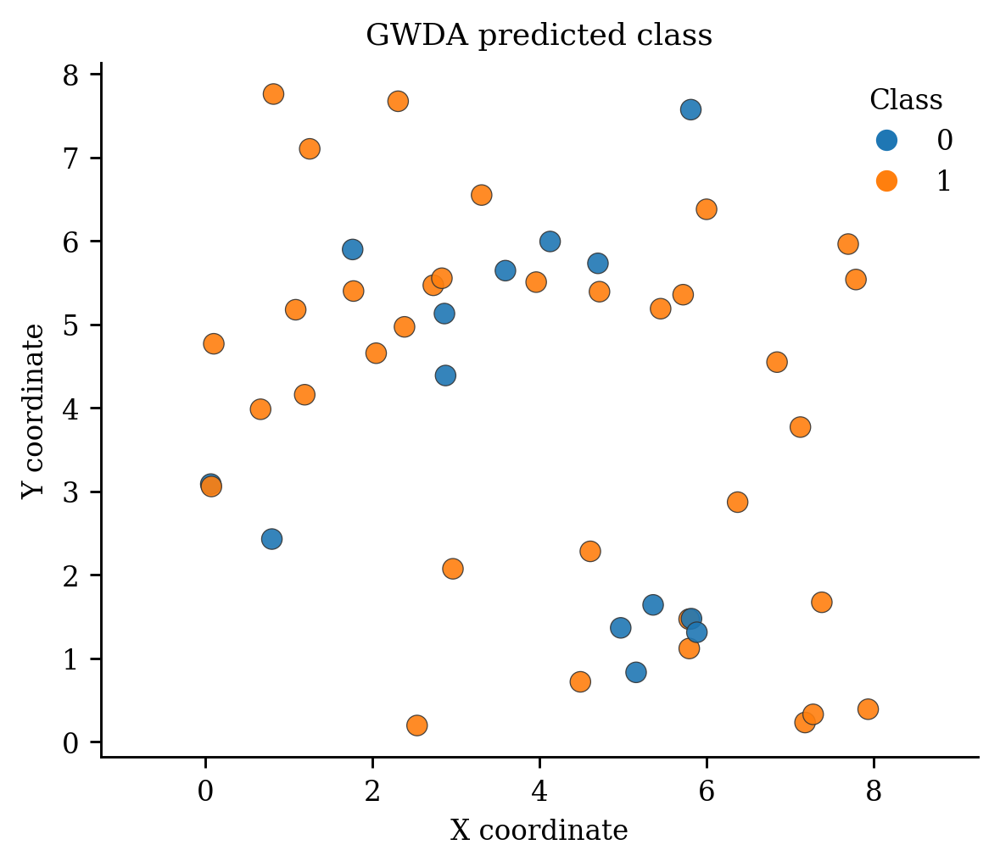
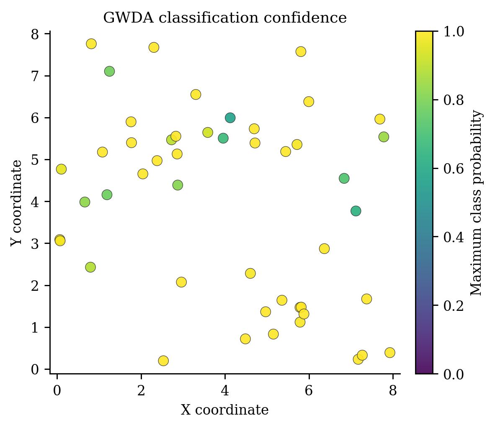
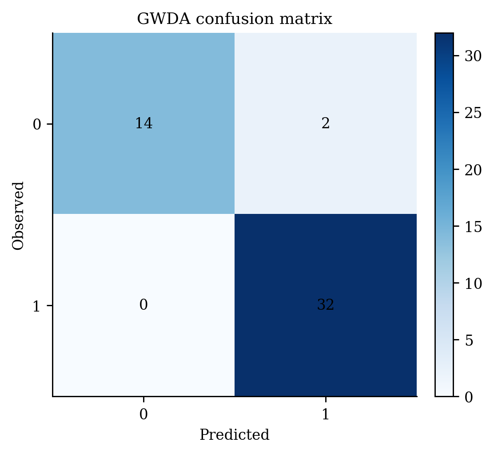

# Geographically Weighted Discriminant Analysis (`GWDA`)

<div class="model-hero" markdown>

**Family:** Local spatial classification
**Install:** `pip install -e ".[all]"`
**Required data:** X, class labels, coordinates
**Primary operations:** fit, predict, predict_proba
**New-location capability:** Validated class labels and local class probabilities.

</div>

[API reference](../api/models/gwda.md){ .md-button .md-button--primary }
[Runnable source](https://github.com/hujinghaoabcd/pyGWRx/blob/main/examples/models/10_gwda.py){ .md-button }
[Choose a model](../getting-started/choosing-a-model.md){ .md-button }

## Why this model exists

Use GWDA when class separation and class distributions may vary geographically and a locally interpretable discriminant model is appropriate.

!!! note "One-sentence idea"
    GWDA estimates class priors, means, and covariance structures with geographic weights, then evaluates local discriminant scores at each target location.

## Statistical formulation

For local linear discriminant analysis, a class score has the form

$$
\delta_c(x;s_i)=x^\top\Sigma_i^{-1}\mu_{c,i}
-\frac12\mu_{c,i}^\top\Sigma_i^{-1}\mu_{c,i}+\log\pi_{c,i}.
$$

GWQDA uses class-specific local covariance matrices. The implementation can localize means, covariance, priors, or combinations of them.

## How pyGWRx fits the model

1. Encode class labels and validate local class support.
2. Construct geographic weights at each focal location.
3. Estimate configured local priors, class means, and covariance matrices.
4. Regularize covariance matrices when needed.
5. Compute class scores and normalized probabilities.
6. Predict the maximum-score class at new coordinates.

## Constructor and important controls

```python
GWDA(kernel: 'str | Any' = 'bisquare', bandwidth: 'float | int | str | None' = 'cv', adaptive: 'bool' = True, quadratic: 'bool' = False, local_mean: 'bool' = True, local_cov: 'bool' = True, local_prior: 'bool' = True, prior: 'np.ndarray | list[float] | tuple[float, ...] | None' = None, regularization: 'float' = 0.0, verbose: 'bool' = False) -> 'None'
```

The API page documents every parameter and fitted attribute. In practice, start by deciding the **data contract**, **neighbourhood definition**, **selection criterion**, and **prediction/inference goal** before tuning secondary controls.

| Decision | Questions to answer |
|---|---|
| Data | Are rows independent observations, ordered stages, classes, counts, or multivariate features? |
| Distance | Are coordinates projected? Is time or contextual similarity part of the neighbourhood? |
| Bandwidth | Fixed distance or adaptive neighbours? Supplied value or selected criterion? |
| Inference | Are local uncertainty, non-stationarity tests, or only prediction required? |
| Validation | Does the split respect spatial and, where relevant, temporal dependence? |

## Complete runnable example

The following is the exact maintained example used by the API-coverage checks.

```python
# SPDX-FileCopyrightText: 2026 Jinghao Hu
# SPDX-License-Identifier: MIT

"""Fit geographically weighted discriminant analysis."""

from pygwrx import GWDA
from _common import classification_data

X, y, coords = classification_data()
model = GWDA(bandwidth=28, adaptive=True, quadratic=False).fit(X, y, coords)
print(model.summary())
print("classes=", model.classes_)
print("predictions=", model.predict(X.iloc[:5], coords.iloc[:5]))
print("probabilities=", model.predict_proba(X.iloc[:5], coords.iloc[:5]))
```

Run it from the `examples/models` directory or through `python examples/run_all.py`.

## Reading the fitted result

**Main outputs:** Class labels, local class probabilities, class-specific local statistics, confusion information, summaries, and prediction methods.

Available high-level methods detected in the current class are: `fit()`, `predict()`, `predict_proba()`, `select_bandwidth()`, `summary()`.

A safe inspection sequence is:

```python
# 1. Human-readable overview
print(model.summary()) if hasattr(model, "summary") else None

# 2. Location-indexed table when supported
frame = model.to_frame() if hasattr(model, "to_frame") else None

# 3. Explicitly inspect the model-specific state
print([name for name in vars(model) if name.endswith("_")])
```

Do not assume that every model exposes the same outputs. Regression, classification, transformation, descriptive-statistics, and inference models have different result semantics.

## Diagnostics and interpretation

Inspect confusion matrices, probability confidence, class support by neighbourhood, and spatial patterns of error. Use spatially blocked validation rather than random folds when spatial transfer matters.

The common diagnostics layer can be used where the fitted model provides the required fields:

```python
from pygwrx.diagnostics import diagnostics_frame, local_diagnostic_frame

print(diagnostics_frame([model], labels=["GWDA"]))
try:
    print(local_diagnostic_frame(model).head())
except (AttributeError, NotImplementedError, ValueError) as exc:
    print("This model exposes a different diagnostic contract:", exc)
```

See [Diagnostics and inference](../guides/diagnostics.md) for model-aware checks and interpretation rules.

## Recommended visual checks


<div class="figure-grid" markdown>

<figure markdown>
  { loading=lazy }
  <figcaption>15 Gwda Class</figcaption>
</figure>

<figure markdown>
  { loading=lazy }
  <figcaption>16 Gwda Confidence</figcaption>
</figure>

<figure markdown>
  { loading=lazy }
  <figcaption>17 Gwda Confusion</figcaption>
</figure>

</div>


The figures are generated from deterministic examples and are illustrative; they are not benchmark claims.

## Common mistakes

- Very small local class counts.
- Singular local covariance matrices without regularization.
- Treating high in-sample accuracy as spatial generalization.
- Ignoring class imbalance and locally varying priors.

## What to report in a paper or technical report

- Linear or quadratic mode.
- Which priors, means, and covariance terms were localized.
- Bandwidth and regularization.
- Spatial validation design and class-wise metrics.
- Maps of confidence and misclassification.

## References

- [Brunsdon, Fotheringham & Charlton (2007), *Geographically Weighted Discriminant Analysis*](https://doi.org/10.1111/j.1538-4632.2007.00709.x)

## Related documentation

- [Detailed API for `GWDA`](../api/models/gwda.md)
- [Maintained example source](https://github.com/hujinghaoabcd/pyGWRx/blob/main/examples/models/10_gwda.py)
- [Kernels and bandwidths](../guides/kernels-and-bandwidths.md)
- [Prediction and result objects](../guides/prediction-and-results.md)
- [Complete Chinese model guide](../zh/models/gwda.md)
