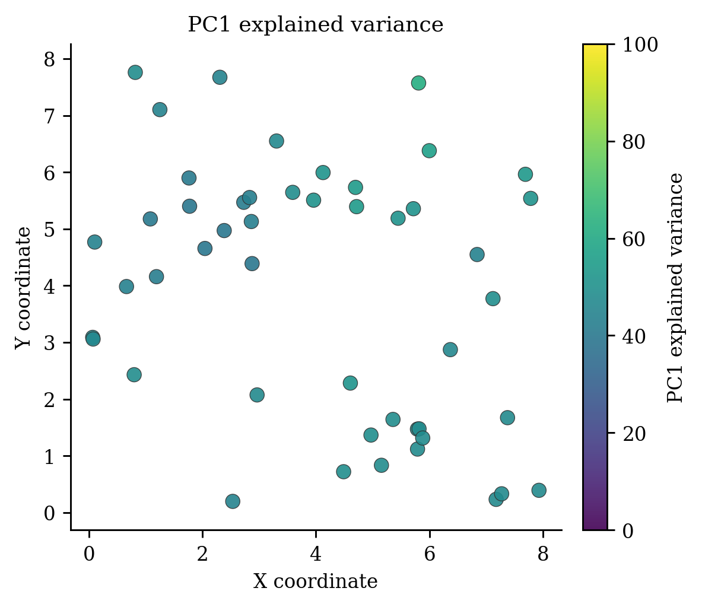
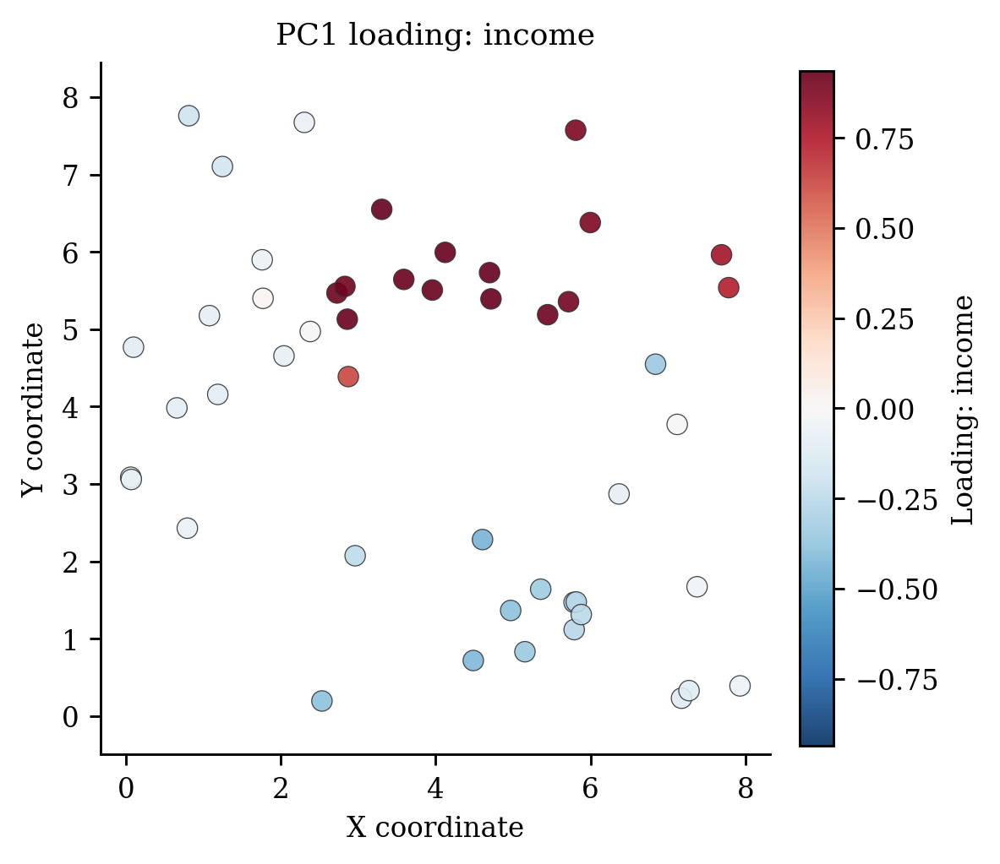

# Geographically Weighted Principal Component Analysis (`GWPCA`)

<div class="model-hero" markdown>

**Family:** Local multivariate transformation
**Install:** `pip install -e ".[ml]"`
**Required data:** Multivariate X and coordinates
**Primary operations:** fit, transform, select_bandwidth
**New-location capability:** Not a response predictor; `transform()` returns local component scores.

</div>

[API reference](../api/models/gwpca.md){ .md-button .md-button--primary }
[Runnable source](https://github.com/hujinghaoabcd/pyGWRx/blob/main/examples/models/09_gwpca.py){ .md-button }
[Choose a model](../getting-started/choosing-a-model.md){ .md-button }

## Why this model exists

Use GWPCA to explore how multivariate covariance, dominant dimensions, and loadings vary over space.

!!! note "One-sentence idea"
    GWPCA computes a geographically weighted covariance matrix at every focal location and decomposes it into local eigenvalues and eigenvectors.

## Statistical formulation

For focal location $s_i$, the weighted covariance matrix is

$$
S_i=\frac{(X-\bar X_i)^\top W_i(X-\bar X_i)}{\sum_jw_{ij}},
$$

followed by $S_i=V_i\Lambda_iV_i^\top$. Local explained variance and loadings can therefore change from one location to another.

## How pyGWRx fits the model

1. Validate and optionally scale the multivariate features.
2. Select or apply a kernel bandwidth.
3. Compute local weighted means and covariance matrices.
4. Perform an eigen-decomposition at every location.
5. Order components and calculate local proportion of variance.
6. Optionally calculate scores or transform observations into local component coordinates.

## Constructor and important controls

```python
GWPCA(n_components: 'int' = 2, kernel: 'str | Any' = 'bisquare', bandwidth: 'float | int | str | None' = 'cv', adaptive: 'bool' = True, scaling: 'bool' = True, compute_scores: 'bool' = False, verbose: 'bool' = False) -> 'None'
```

The API page documents every parameter and fitted attribute. In practice, start by deciding the **data contract**, **neighbourhood definition**, **selection criterion**, and **prediction/inference goal** before tuning secondary controls.

| Decision | Questions to answer |
|---|---|
| Data | Are rows independent observations, ordered stages, classes, counts, or multivariate features? |
| Distance | Are coordinates projected? Is time or contextual similarity part of the neighbourhood? |
| Bandwidth | Fixed distance or adaptive neighbours? Supplied value or selected criterion? |
| Inference | Are local uncertainty, non-stationarity tests, or only prediction required? |
| Validation | Does the split respect spatial and, where relevant, temporal dependence? |

## Complete runnable example

The following is the exact maintained example used by the API-coverage checks.

```python
# SPDX-FileCopyrightText: 2026 Jinghao Hu
# SPDX-License-Identifier: MIT

"""Fit GWPCA, inspect local loadings, and transform observations."""

from pygwrx import GWPCA
from _common import print_model_result, spatial_regression

X, _, coords = spatial_regression(n=48, p=3)
model = GWPCA(n_components=2, bandwidth=24, adaptive=True).fit(
    X, coords, compute_cv=True
)
print_model_result(model)
print("scores_shape=", model.transform(X, coords).shape)
print("explained_variance_first_location=", model.local_pv_[0])
```

Run it from the `examples/models` directory or through `python examples/run_all.py`.

## Reading the fitted result

**Main outputs:** Local eigenvalues, loadings, proportion-of-variance arrays such as `local_pv_`, optional scores, transformed values, summaries, and `to_frame()`.

Available high-level methods detected in the current class are: `fit()`, `transform()`, `select_bandwidth()`, `summary()`, `to_frame()`.

A safe inspection sequence is:

```python
# 1. Human-readable overview
print(model.summary()) if hasattr(model, "summary") else None

# 2. Location-indexed table when supported
frame = model.to_frame() if hasattr(model, "to_frame") else None

# 3. Explicitly inspect the model-specific state
print([name for name in vars(model) if name.endswith("_")])
```

Do not assume that every model exposes the same outputs. Regression, classification, transformation, descriptive-statistics, and inference models have different result semantics.

## Diagnostics and interpretation

Map explained variance and selected loadings, check sign indeterminacy before comparing loading surfaces, and inspect sensitivity to scaling and bandwidth.

The common diagnostics layer can be used where the fitted model provides the required fields:

```python
from pygwrx.diagnostics import diagnostics_frame, local_diagnostic_frame

print(diagnostics_frame([model], labels=["GWPCA"]))
try:
    print(local_diagnostic_frame(model).head())
except (AttributeError, NotImplementedError, ValueError) as exc:
    print("This model exposes a different diagnostic contract:", exc)
```

See [Diagnostics and inference](../guides/diagnostics.md) for model-aware checks and interpretation rules.

## Recommended visual checks


<div class="figure-grid" markdown>

<figure markdown>
  { loading=lazy }
  <figcaption>13 Gwpca Variance</figcaption>
</figure>

<figure markdown>
  { loading=lazy }
  <figcaption>14 Gwpca Loading</figcaption>
</figure>

</div>


The figures are generated from deterministic examples and are illustrative; they are not benchmark claims.

## Common mistakes

- Comparing loading signs without alignment because eigenvector signs are arbitrary.
- Skipping scaling when variables have incompatible units.
- Interpreting components as fixed constructs across space when loadings rotate.

## What to report in a paper or technical report

- Variables and scaling method.
- Bandwidth and kernel.
- Number of retained components.
- Local explained variance and loading interpretation.
- How sign/rotation comparability was handled.

## References

- [Harris, Brunsdon & Charlton (2011), *Geographically weighted principal components analysis*](https://doi.org/10.1080/13658816.2011.554838)

## Related documentation

- [Detailed API for `GWPCA`](../api/models/gwpca.md)
- [Maintained example source](https://github.com/hujinghaoabcd/pyGWRx/blob/main/examples/models/09_gwpca.py)
- [Kernels and bandwidths](../guides/kernels-and-bandwidths.md)
- [Prediction and result objects](../guides/prediction-and-results.md)
- [Complete Chinese model guide](../zh/models/gwpca.md)
