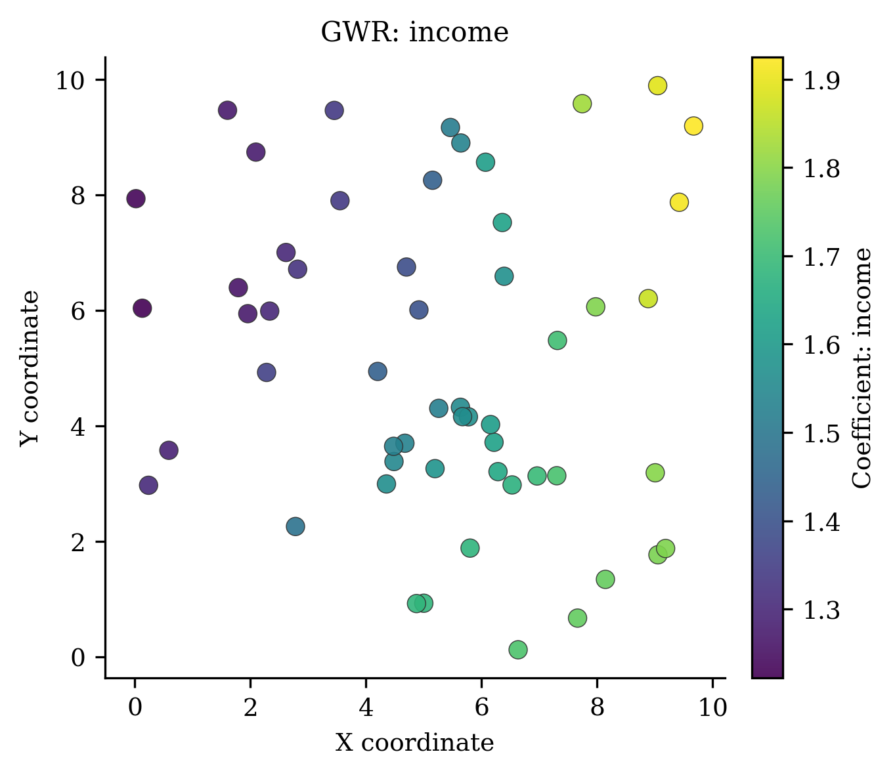
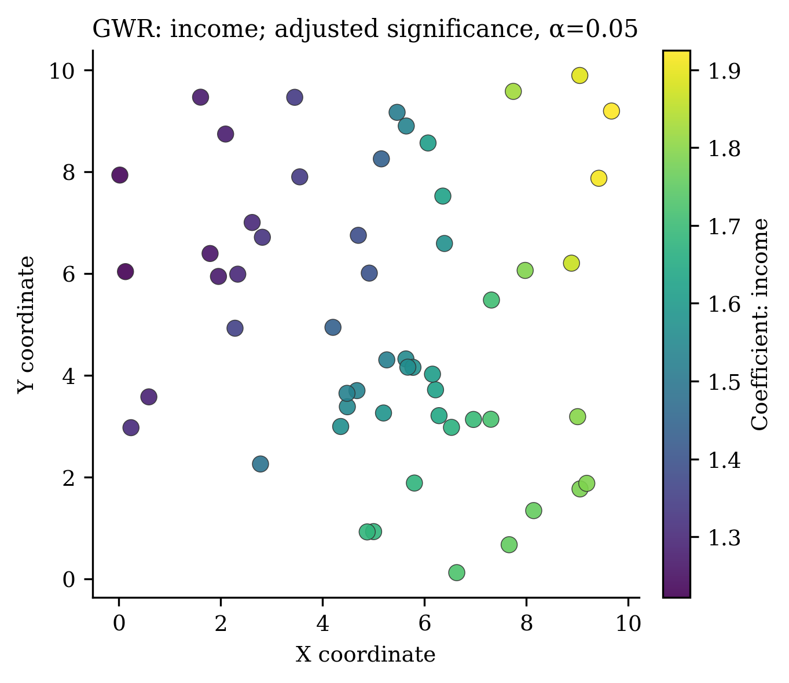
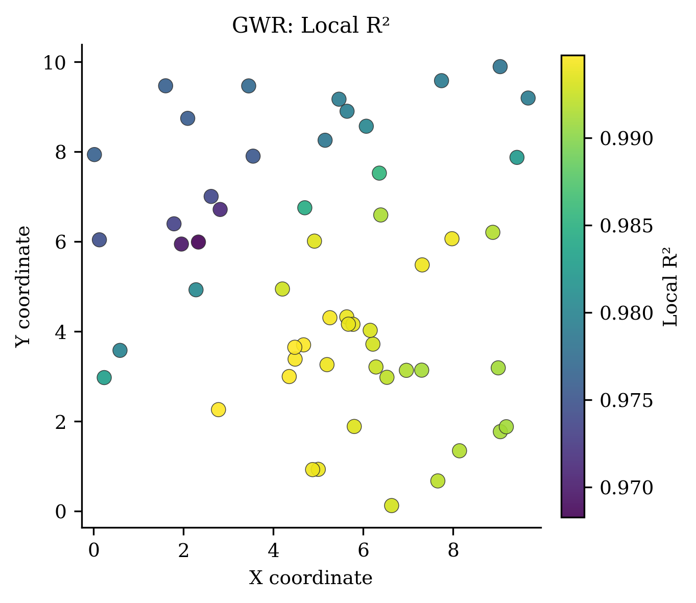
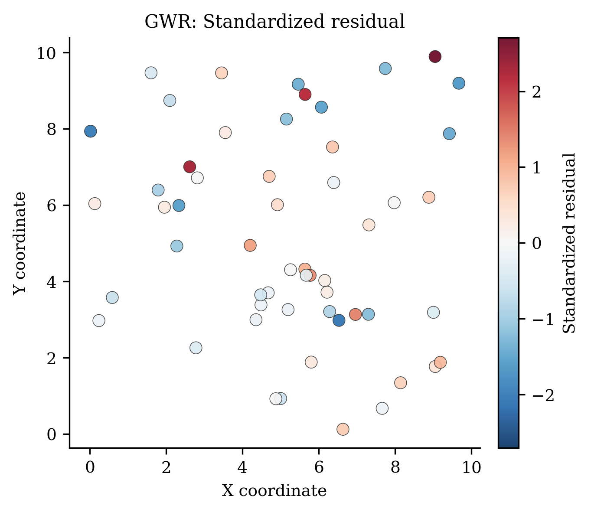
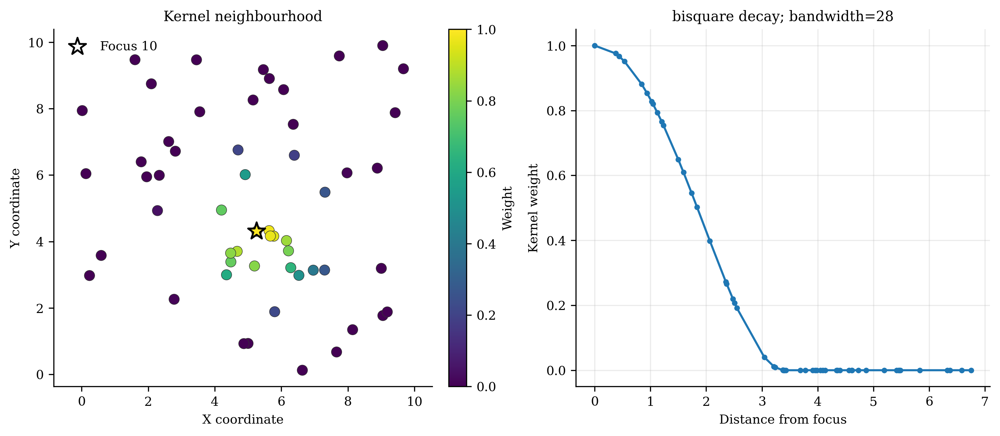
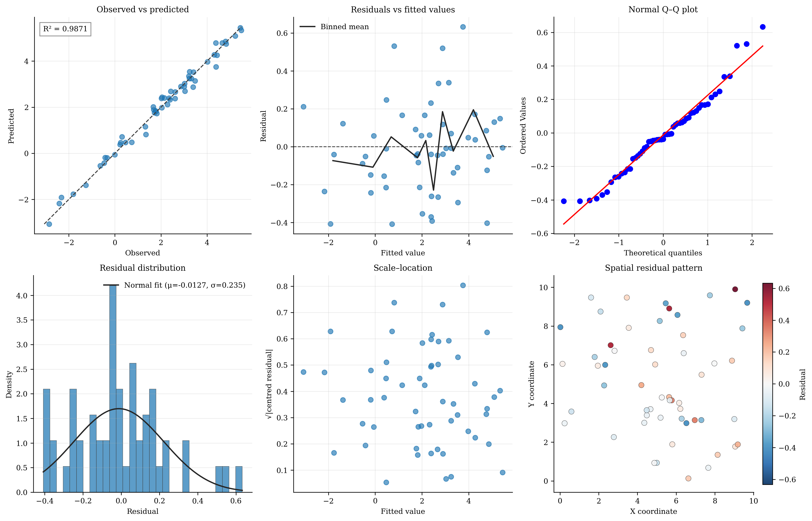

# Standard Geographically Weighted Regression (`GWR`)

<div class="model-hero" markdown>

**Family:** Classic local regression
**Install:** `pip install -e ".[all]"`
**Required data:** X, y, coordinates
**Primary operations:** fit, score, predict, predict_result
**New-location capability:** Validated local re-calibration at new coordinates.

</div>

[API reference](../api/models/gwr.md){ .md-button .md-button--primary }
[Runnable source](https://github.com/hujinghaoabcd/pyGWRx/blob/main/examples/models/01_gwr.py){ .md-button }
[Choose a model](../getting-started/choosing-a-model.md){ .md-button }

## Why this model exists

Use GWR as the transparent baseline when a continuous-response relationship may vary smoothly over space and one common bandwidth is scientifically defensible.

!!! note "One-sentence idea"
    GWR replaces one global coefficient vector with a coefficient vector estimated at every calibration location. Nearby observations receive larger weights, so each local regression summarizes the relationship around its focal location.

## Statistical formulation

For a focal location $s_i$, pyGWRx estimates

$$
\widehat{\boldsymbol\beta}(s_i)
=\left(X^\top W_i X\right)^{-1}X^\top W_i y,
$$

where $W_i=\operatorname{diag}(w_{i1},\ldots,w_{in})$ is generated from the selected kernel and bandwidth. A fixed bandwidth is a distance; an adaptive bandwidth is a neighbour count whose local distance threshold changes with sampling density.

## How pyGWRx fits the model

1. Validate and standardize the design contract; add an intercept when requested.
2. Compute distances from every calibration location to the training observations.
3. Use a supplied bandwidth or select one with CV/AICc.
4. Solve one weighted least-squares problem per location.
5. Assemble fitted values, residuals, local inference, leverage, local R², information criteria, and result tables.
6. For new coordinates, form new local weights and re-estimate local coefficients rather than interpolating training coefficients.

## Constructor and important controls

```python
GWR(kernel: 'Union[str, Callable[[np.ndarray, float], np.ndarray]]' = 'gaussian', bandwidth: 'Union[float, int, str, None]' = 'cv', bandwidth_method: 'str' = 'cv', adaptive: 'bool' = False, bandwidth_range: 'Optional[Tuple[float, float]]' = None, optimization_method: 'str' = 'golden_section', fit_intercept: 'bool' = True, distance_metric: 'str' = 'euclidean', sigma2_v1: 'bool' = True verbose: 'bool' = False) -> 'None'
```

The API page documents every parameter and fitted attribute. In practice, start by deciding the **data contract**, **neighbourhood definition**, **selection criterion**, and **prediction/inference goal** before tuning secondary controls.

| Decision | Questions to answer |
|---|---|
| Data | Are rows independent observations, ordered stages, classes, counts, or multivariate features? |
| Distance | Are coordinates projected? Is time or contextual similarity part of the neighbourhood? |
| Bandwidth | Fixed distance or adaptive neighbours? Supplied value or selected criterion? |
| Inference | Are local uncertainty, non-stationarity tests, or only prediction required? |
| Validation | Does the split respect spatial and, where relevant, temporal dependence? |

## Complete runnable example

The following is the exact maintained example used by the API-coverage checks.

```python
# SPDX-FileCopyrightText: 2026 Jinghao Hu
# SPDX-License-Identifier: MIT

"""Fit, inspect, predict, and export a standard GWR model."""

from pygwrx import GWR, GWRPredictionResult
from _common import print_model_result, spatial_regression

X, y, coords = spatial_regression()
model = GWR(kernel="bisquare", bandwidth=24, adaptive=True).fit(X, y, coords)
print_model_result(model)
print("score=", model.score(X, y, coords))
result = model.predict_result(X.iloc[:3], coords.iloc[:3])
assert isinstance(result, GWRPredictionResult)
print(result.to_frame())
```

Run it from the `examples/models` directory or through `python examples/run_all.py`.

## Reading the fitted result

**Main outputs:** `coef_`, `intercept_`, `fitted_values_`, `residuals_`, `bandwidth_`, `diagnostics_`, local inference arrays, `summary()`, `to_frame()`, and `GWRPredictionResult`.

Available high-level methods detected in the current class are: `fit()`, `score()`, `predict()`, `predict_result()`, `summary()`, `to_frame()`.

A safe inspection sequence is:

```python
# 1. Human-readable overview
print(model.summary()) if hasattr(model, "summary") else None

# 2. Location-indexed table when supported
frame = model.to_frame() if hasattr(model, "to_frame") else None

# 3. Explicitly inspect the model-specific state
print([name for name in vars(model) if name.endswith("_")])
```

Do not assume that every model exposes the same outputs. Regression, classification, transformation, descriptive-statistics, and inference models have different result semantics.

## Diagnostics and interpretation

Always inspect bandwidth sensitivity, local condition numbers, coefficient uncertainty, influential observations, Local R², and residual spatial structure. Compare against a global model before interpreting coefficient surfaces.

The common diagnostics layer can be used where the fitted model provides the required fields:

```python
from pygwrx.diagnostics import diagnostics_frame, local_diagnostic_frame

print(diagnostics_frame([model], labels=["GWR"]))
try:
    print(local_diagnostic_frame(model).head())
except (AttributeError, NotImplementedError, ValueError) as exc:
    print("This model exposes a different diagnostic contract:", exc)
```

See [Diagnostics and inference](../guides/diagnostics.md) for model-aware checks and interpretation rules.

## Recommended visual checks


<div class="figure-grid" markdown>

<figure markdown>
  { loading=lazy }
  <figcaption>01 Coefficient</figcaption>
</figure>

<figure markdown>
  { loading=lazy }
  <figcaption>02 Coefficient Significant</figcaption>
</figure>

<figure markdown>
  { loading=lazy }
  <figcaption>04 Local R2</figcaption>
</figure>

<figure markdown>
  { loading=lazy }
  <figcaption>05 Standardized Residual</figcaption>
</figure>

<figure markdown>
  { loading=lazy }
  <figcaption>10 Kernel Weights</figcaption>
</figure>

<figure markdown>
  { loading=lazy }
  <figcaption>12 Diagnostic Panel</figcaption>
</figure>

</div>


The figures are generated from deterministic examples and are illustrative; they are not benchmark claims.

## Common mistakes

- Treating local coefficients as causal effects.
- Using longitude/latitude with Euclidean distance without an appropriate projection.
- Comparing fixed and adaptive bandwidths as if they have the same unit.
- Mapping raw coefficients without significance, collinearity, and residual diagnostics.

## What to report in a paper or technical report

- Kernel and whether the bandwidth is fixed or adaptive.
- Bandwidth-selection criterion and search range.
- Coordinate reference system or distance metric.
- ENP, AICc/CV, global fit, local coefficient distribution, and uncertainty.
- Residual and local-collinearity checks.

## References

- [Brunsdon, Fotheringham & Charlton (1996), *Geographically Weighted Regression: A Method for Exploring Spatial Nonstationarity*](https://doi.org/10.1111/j.1538-4632.1996.tb00936.x)
- [Fotheringham, Brunsdon & Charlton (2002), *Geographically Weighted Regression: The Analysis of Spatially Varying Relationships*](https://www.wiley.com/en-us/Geographically+Weighted+Regression%3A+The+Analysis+of+Spatially+Varying+Relationships-p-9780471496168)
- [Comber et al. (2022), *A route map for the informed application of GWR*](https://doi.org/10.1111/gean.12316)

## Related documentation

- [Detailed API for `GWR`](../api/models/gwr.md)
- [Maintained example source](https://github.com/hujinghaoabcd/pyGWRx/blob/main/examples/models/01_gwr.py)
- [Kernels and bandwidths](../guides/kernels-and-bandwidths.md)
- [Prediction and result objects](../guides/prediction-and-results.md)
- [Complete Chinese model guide](../zh/models/gwr.md)
