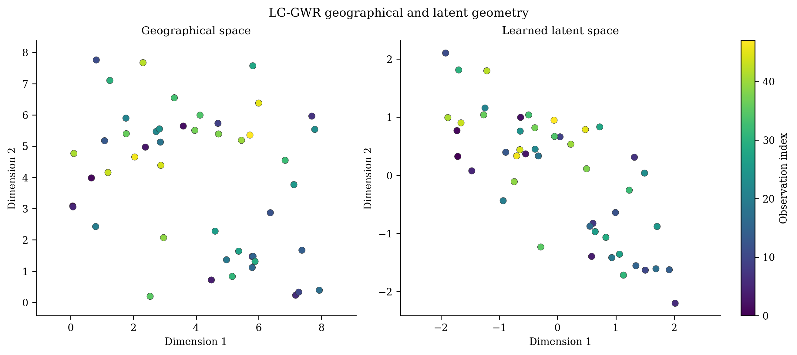
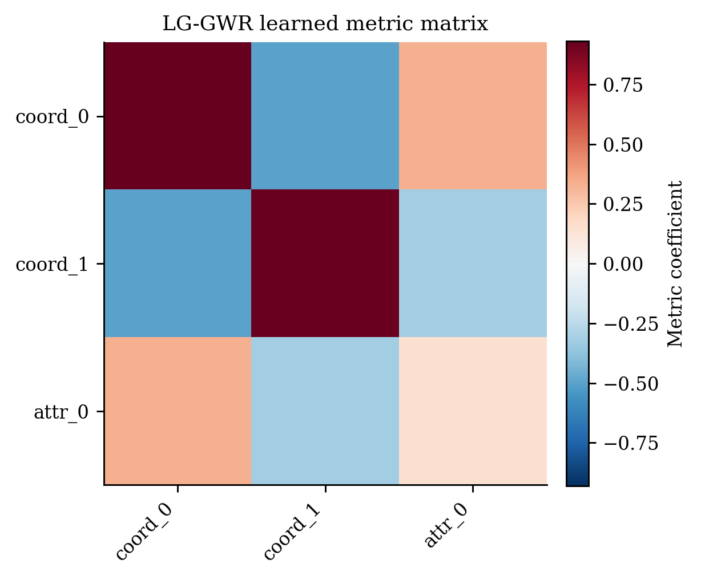
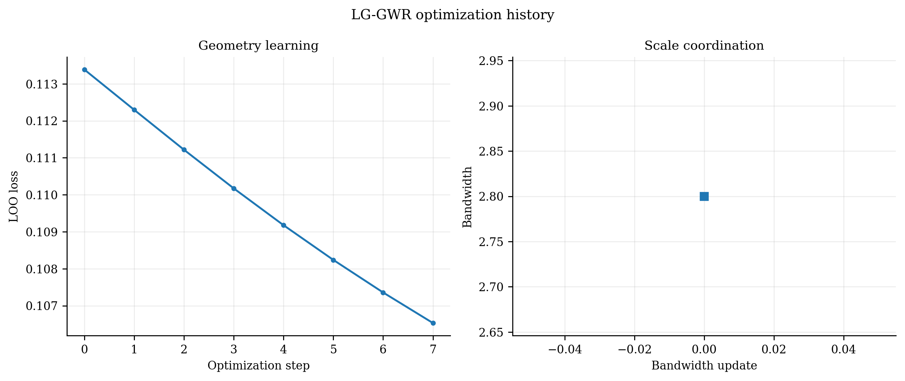
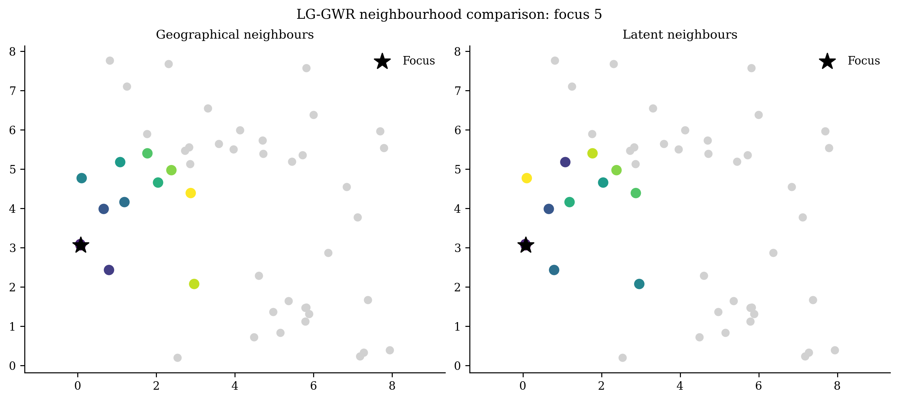

# Latent-Geometry Geographically Weighted Regression (`LGGWR`)

<div class="model-hero" markdown>

**Family:** Original research model
**Install:** `pip install -e ".[all]"`
**Required data:** X, y, coordinates, and contextual attributes
**Primary operations:** fit, predict, predict_result
**New-location capability:** Validated using the learned geometry transform and target attributes.

</div>

[API reference](../api/models/lg-gwr.md){ .md-button .md-button--primary }
[Runnable source](https://github.com/hujinghaoabcd/pyGWRx/blob/main/examples/models/18_lg_gwr.py){ .md-button }
[Choose a model](../getting-started/choosing-a-model.md){ .md-button }

## Why this model exists

Use LGGWR as a research model when effective neighbourhoods are believed to depend on geography plus contextual attributes and physical distance alone is inadequate.

!!! note "One-sentence idea"
    LGGWR learns a low-dimensional geometry or metric from coordinates and contextual attributes, then performs local regression in that learned geometry.

## Statistical formulation

Let $q_i$ combine coordinates and contextual attributes. A learned transform $A$ defines latent coordinates $z_i=Aq_i$ and distance

$$
d_{ij}^{L}=\lVert z_i-z_j\rVert_2
=\sqrt{(q_i-q_j)^\top A^\top A(q_i-q_j)}.
$$

The model jointly balances local regression fit, geometry regularization, scale constraints, and optional bandwidth updates.

## How pyGWRx fits the model

1. Standardize geometry inputs and initialize the latent transform.
2. Construct latent coordinates and local kernel weights.
3. Solve local regressions in the current geometry.
4. Differentiate the objective and update the geometry with clipping and constraints.
5. Use patience, restarts, and optional bandwidth updates to stabilize optimization.
6. Transform target coordinates/attributes with the fitted geometry for prediction.

## Constructor and important controls

```python
LGGWR(latent_dim: 'int' = 2, bandwidth: 'BandwidthLike' = None, adaptive: 'bool' = False, kernel: 'str' = 'gaussian', geometry: 'str' = 'joint', learning_rate: 'float' = 0.05, max_iter: 'int' = 100, tol: 'float' = 1e-06, lambda_reg: 'float' = 0.0, orthogonal_constraint: 'Optional[bool]' = None, grad_clip: 'float' = 10.0, patience: 'int' = 20, select_bandwidth: 'bool' = True, random_state: 'Optional[int]' = None, verbose: 'bool' = False, *, fit_intercept: 'bool' = True, standardize_geometry: 'bool' = True, initialization: 'str' = 'coordinate', n_restarts: 'int' = 1, scale_constraint: 'str' = 'frobenius', bandwidth_updates: 'int' = 1) -> 'None'
```

The API page documents every parameter and fitted attribute. In practice, start by deciding the **data contract**, **neighbourhood definition**, **selection criterion**, and **prediction/inference goal** before tuning secondary controls.

| Decision | Questions to answer |
|---|---|
| Data | Are rows independent observations, ordered stages, classes, counts, or multivariate features? |
| Distance | Are coordinates projected? Is time or contextual similarity part of the neighbourhood? |
| Bandwidth | Fixed distance or adaptive neighbours? Supplied value or selected criterion? |
| Inference | Are local uncertainty, non-stationarity tests, or only prediction required? |
| Validation | Does the split respect spatial and, where relevant, temporal dependence? |

## Complete runnable example

The following is the exact maintained example used by the API-coverage checks.

```python
# SPDX-FileCopyrightText: 2026 Jinghao Hu
# SPDX-License-Identifier: MIT

"""Fit latent-geometry GWR with auxiliary contextual attributes."""

from pygwrx import LGGWR, LGGWRPredictionResult
from _common import latent_regression, print_model_result

X, y, coords, attributes = latent_regression()
model = LGGWR(
    latent_dim=2, bandwidth=2.5, select_bandwidth=False, max_iter=8, random_state=0
).fit(X, y, coords, attributes)
print_model_result(model)
print("latent_coordinates_shape=", model.latent_coords_.shape)
result = model.predict_result(X.iloc[:3], coords.iloc[:3], attributes.iloc[:3])
assert isinstance(result, LGGWRPredictionResult)
print(result.to_frame())
```

Run it from the `examples/models` directory or through `python examples/run_all.py`.

## Reading the fitted result

**Main outputs:** `latent_coords_`, learned metric/transform information, training history, selected bandwidth state, local coefficients, predictions, result tables, and `LGGWRPredictionResult`.

Available high-level methods detected in the current class are: `fit()`, `predict()`, `predict_result()`, `summary()`, `to_frame()`.

A safe inspection sequence is:

```python
# 1. Human-readable overview
print(model.summary()) if hasattr(model, "summary") else None

# 2. Location-indexed table when supported
frame = model.to_frame() if hasattr(model, "to_frame") else None

# 3. Explicitly inspect the model-specific state
print([name for name in vars(model) if name.endswith("_")])
```

Do not assume that every model exposes the same outputs. Regression, classification, transformation, descriptive-statistics, and inference models have different result semantics.

## Diagnostics and interpretation

Inspect latent geometry, metric matrix, objective history, restart agreement, neighbourhood changes relative to geographic GWR, and sensitivity to attribute scaling.

The common diagnostics layer can be used where the fitted model provides the required fields:

```python
from pygwrx.diagnostics import diagnostics_frame, local_diagnostic_frame

print(diagnostics_frame([model], labels=["LGGWR"]))
try:
    print(local_diagnostic_frame(model).head())
except (AttributeError, NotImplementedError, ValueError) as exc:
    print("This model exposes a different diagnostic contract:", exc)
```

See [Diagnostics and inference](../guides/diagnostics.md) for model-aware checks and interpretation rules.

## Recommended visual checks


<div class="figure-grid" markdown>

<figure markdown>
  { loading=lazy }
  <figcaption>27 Lggwr Latent</figcaption>
</figure>

<figure markdown>
  { loading=lazy }
  <figcaption>28 Lggwr Metric</figcaption>
</figure>

<figure markdown>
  { loading=lazy }
  <figcaption>29 Lggwr Training</figcaption>
</figure>

<figure markdown>
  { loading=lazy }
  <figcaption>30 Lggwr Neighbours</figcaption>
</figure>

</div>


The figures are generated from deterministic examples and are illustrative; they are not benchmark claims.

## Common mistakes

- Treating the latent axes as uniquely identified physical dimensions.
- Using outcome proxies or post-treatment attributes in the geometry.
- Reporting one optimization run without restart sensitivity.
- Ignoring scale constraints and standardization.

## What to report in a paper or technical report

- Geometry inputs and preprocessing.
- Latent dimension, initialization, constraints, regularization, learning rate, and restarts.
- Optimization convergence and objective history.
- Neighbourhood comparison with standard geography.
- Validation scope and research-model limitations.

## References

- [Brunsdon, Fotheringham & Charlton (1996), *Geographically Weighted Regression: A Method for Exploring Spatial Nonstationarity*](https://doi.org/10.1111/j.1538-4632.1996.tb00936.x)
- [Lessani & Li (2024), *SGWR: similarity and geographically weighted regression*](https://doi.org/10.1080/13658816.2024.2342319)
- [Hagenauer & Helbich (2022), *A geographically weighted artificial neural network*](https://doi.org/10.1080/13658816.2021.1871618)

## Related documentation

- [Detailed API for `LGGWR`](../api/models/lg-gwr.md)
- [Maintained example source](https://github.com/hujinghaoabcd/pyGWRx/blob/main/examples/models/18_lg_gwr.py)
- [Kernels and bandwidths](../guides/kernels-and-bandwidths.md)
- [Prediction and result objects](../guides/prediction-and-results.md)
- [Complete Chinese model guide](../zh/models/lg-gwr.md)
