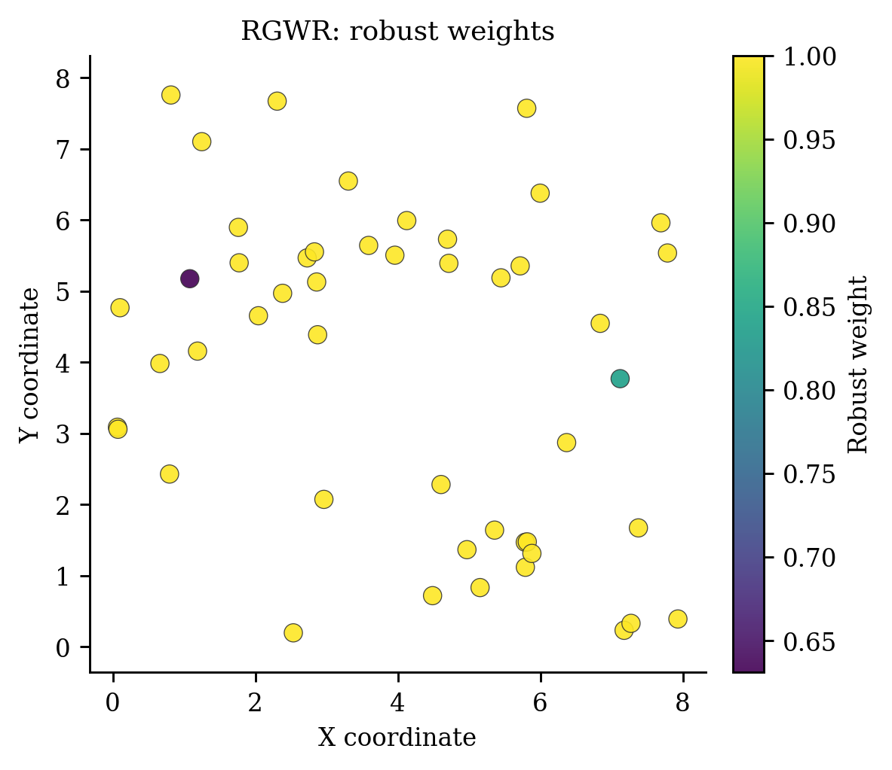
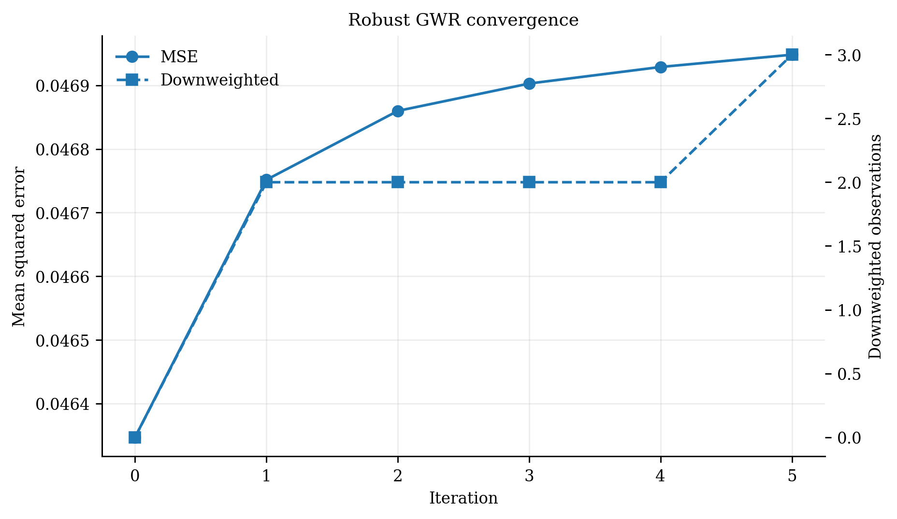

# Robust Geographically Weighted Regression (`RGWR`)

<div class="model-hero" markdown>

**Family:** Robust local regression
**Install:** `pip install -e ".[all]"`
**Required data:** X, y, coordinates
**Primary operations:** fit, score, predict, predict_result
**New-location capability:** Validated local prediction using the fitted robust calibration state.

</div>

[API reference](../api/models/rgwr.md){ .md-button .md-button--primary }
[Runnable source](https://github.com/hujinghaoabcd/pyGWRx/blob/main/examples/models/03_rgwr.py){ .md-button }
[Choose a model](../getting-started/choosing-a-model.md){ .md-button }

## Why this model exists

Use RGWR when a small number of response outliers or high-residual observations would otherwise contaminate many overlapping local regressions.

!!! note "One-sentence idea"
    RGWR multiplies geographical kernel weights by observation-level robust weights derived from residuals. Outlying observations progressively contribute less to every local fit they influence.

## Statistical formulation

At iteration $t$, the effective weight is

$$
\widetilde w_{ij}^{(t)}=w_{ij}^{G}r_j^{(t)},
$$

where $w_{ij}^{G}$ is the geographical kernel weight and $r_j^{(t)}\in[0,1]$ is a robust residual weight. The local solver remains weighted least squares, but the residual weights are updated until convergence.

## How pyGWRx fits the model

1. Fit an initial GWR.
2. Compute standardized or studentized residuals.
3. Convert residual magnitudes to robust weights using the configured cut points.
4. Multiply robust and geographic weights and refit the local regressions.
5. Repeat until the robust weights or coefficients stabilize, or use filter mode for extreme observations.
6. Retain the final weights and convergence history for diagnosis.

## Constructor and important controls

```python
RGWR(kernel: 'Union[str, Callable[[np.ndarray, float], np.ndarray]]' = 'gaussian', bandwidth: 'Union[float, int, str, None]' = 'cv', bandwidth_method: 'str' = 'cv', adaptive: 'bool' = False, bandwidth_range: 'Optional[Tuple[float, float]]' = None, optimization_method: 'str' = 'golden_section', fit_intercept: 'bool' = True, distance_metric: 'str' = 'euclidean', sigma2_v1: 'bool' = True, method: 'str' = 'automatic', max_iter: 'int' = 20, tol: 'float' = 1e-05, cut1: 'float' = 2.0, cut2: 'float' = 3.0, cut_filter: 'float' = 3.0 verbose: 'bool' = False) -> 'None'
```

The API page documents every parameter and fitted attribute. In practice, start by deciding the **data contract**, **neighbourhood definition**, **selection criterion**, and **prediction/inference goal** before tuning secondary controls.

| Decision | Questions to answer |
|---|---|
| Data | Are rows independent observations, ordered stages, classes, counts, or multivariate features? |
| Distance | Are coordinates projected? Is time or contextual similarity part of the neighbourhood? |
| Bandwidth | Fixed distance or adaptive neighbours? Supplied value or selected criterion? |
| Inference | Are local uncertainty, non-stationarity tests, or only prediction required? |
| Validation | Does the split respect spatial and, where relevant, temporal dependence? |

## Complete runnable example

The following is the exact maintained example used by the API-coverage checks.

```python
# SPDX-FileCopyrightText: 2026 Jinghao Hu
# SPDX-License-Identifier: MIT

"""Fit robust GWR in automatic down-weighting mode."""

import numpy as np
from pygwrx import RGWR
from _common import print_model_result, spatial_regression

X, y, coords = spatial_regression()
y = y.copy()
y[[2, 20]] += np.array([5.0, -4.0])
model = RGWR(bandwidth=24, adaptive=True, max_iter=8).fit(X, y, coords)
print_model_result(model)
print("robust_weights=", model.robust_weights_[:8])
print("predictions=", model.predict(X.iloc[:3], coords.iloc[:3]))
```

Run it from the `examples/models` directory or through `python examples/run_all.py`.

## Reading the fitted result

**Main outputs:** GWR-style coefficients and diagnostics plus `robust_weights_`, outlier indicators, convergence history, predictions, and result tables.

Available high-level methods detected in the current class are: `fit()`, `score()`, `predict()`, `predict_result()`, `summary()`, `to_frame()`.

A safe inspection sequence is:

```python
# 1. Human-readable overview
print(model.summary()) if hasattr(model, "summary") else None

# 2. Location-indexed table when supported
frame = model.to_frame() if hasattr(model, "to_frame") else None

# 3. Explicitly inspect the model-specific state
print([name for name in vars(model) if name.endswith("_")])
```

Do not assume that every model exposes the same outputs. Regression, classification, transformation, descriptive-statistics, and inference models have different result semantics.

## Diagnostics and interpretation

Map and list down-weighted observations, compare standard GWR and RGWR surfaces, and determine whether apparent spatial non-stationarity was driven by a few observations.

The common diagnostics layer can be used where the fitted model provides the required fields:

```python
from pygwrx.diagnostics import diagnostics_frame, local_diagnostic_frame

print(diagnostics_frame([model], labels=["RGWR"]))
try:
    print(local_diagnostic_frame(model).head())
except (AttributeError, NotImplementedError, ValueError) as exc:
    print("This model exposes a different diagnostic contract:", exc)
```

See [Diagnostics and inference](../guides/diagnostics.md) for model-aware checks and interpretation rules.

## Recommended visual checks


<div class="figure-grid" markdown>

<figure markdown>
  { loading=lazy }
  <figcaption>01 Rgwr Weights</figcaption>
</figure>

<figure markdown>
  { loading=lazy }
  <figcaption>02 Rgwr Convergence</figcaption>
</figure>

</div>


The figures are generated from deterministic examples and are illustrative; they are not benchmark claims.

## Common mistakes

- Using robustness to hide data-quality problems.
- Choosing cut points after inspecting the desired result.
- Assuming down-weighted observations are automatically erroneous.
- Ignoring the effect of bandwidth on how far an outlier’s influence propagates.

## What to report in a paper or technical report

- Robust method and cut points.
- Number and locations of down-weighted observations.
- Convergence criterion and iteration count.
- Sensitivity relative to standard GWR.
- Whether substantive conclusions change after robust fitting.

## References

- [Harris, Fotheringham & Juggins (2010), *Robust Geographically Weighted Regression*](https://doi.org/10.1080/00045600903550378)

## Related documentation

- [Detailed API for `RGWR`](../api/models/rgwr.md)
- [Maintained example source](https://github.com/hujinghaoabcd/pyGWRx/blob/main/examples/models/03_rgwr.py)
- [Kernels and bandwidths](../guides/kernels-and-bandwidths.md)
- [Prediction and result objects](../guides/prediction-and-results.md)
- [Complete Chinese model guide](../zh/models/rgwr.md)
