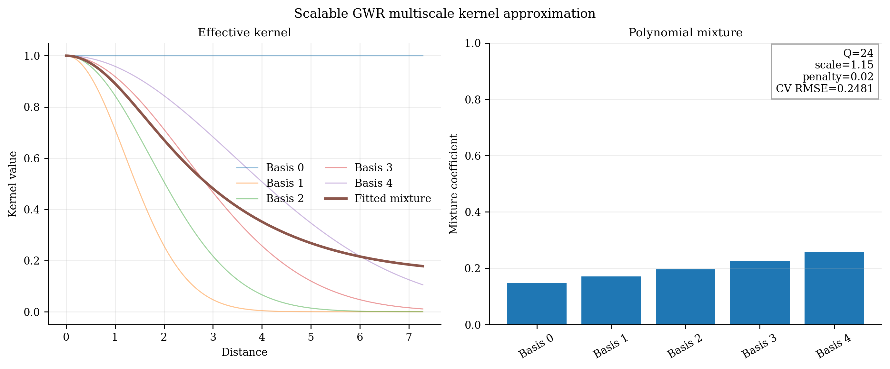

# Scalable Geographically Weighted Regression (`ScalableGWR`)

<div class="model-hero" markdown>

**Family:** Approximate scalable local regression
**Install:** `pip install -e ".[all]"`
**Required data:** X, y, coordinates
**Primary operations:** fit, predict, predict_result
**New-location capability:** Validated using the fitted scalable kernel approximation.

</div>

[API reference](../api/models/scalable-gwr.md){ .md-button .md-button--primary }
[Runnable source](https://github.com/hujinghaoabcd/pyGWRx/blob/main/examples/models/12_scalable_gwr.py){ .md-button }
[Choose a model](../getting-started/choosing-a-model.md){ .md-button }

## Why this model exists

Use ScalableGWR when standard GWR’s repeated dense distance and local-matrix operations are too expensive for the target sample size.

!!! note "One-sentence idea"
    ScalableGWR compresses neighbourhood cross-products into a finite polynomial-kernel representation and optimizes a small set of global approximation parameters.

## Statistical formulation

For a fixed number of neighbours, local cross-products can be pre-aggregated over polynomial basis terms,

$$
A_{i,q}=\sum_{j\in\mathcal N(i)}\phi_q(r_{ij})x_jx_j^\top,\qquad
b_{i,q}=\sum_{j\in\mathcal N(i)}\phi_q(r_{ij})x_jy_j.
$$

A fitted combination of these basis terms rapidly assembles each local normal equation without storing a full dense distance matrix.

## How pyGWRx fits the model

1. Query a bounded number of neighbours per location.
2. Normalize neighbour distances and compute polynomial basis terms.
3. Pre-aggregate local matrix and vector components.
4. Apply or optimize scale, penalty, and kernel-combination parameters.
5. Solve local systems from the compressed representation.
6. Reuse the approximation for target-location prediction.

## Constructor and important controls

```python
ScalableGWR(bandwidth: 'int' = 100, kernel: 'str' = 'gaussian', polynomial: 'int' = 4, criterion: 'str' = 'cv', optimize_bandwidth: 'bool' = True, scale: 'Optional[float]' = None, penalty: 'Optional[float]' = None, fit_intercept: 'bool' = True, sample_size: 'Optional[int]' = None, random_state: 'Optional[int]' = None, optimizer_maxiter: 'int' = 200, numerical_jitter: 'float' = 0.0, verbose: 'bool' = False) -> 'None'
```

The API page documents every parameter and fitted attribute. In practice, start by deciding the **data contract**, **neighbourhood definition**, **selection criterion**, and **prediction/inference goal** before tuning secondary controls.

| Decision | Questions to answer |
|---|---|
| Data | Are rows independent observations, ordered stages, classes, counts, or multivariate features? |
| Distance | Are coordinates projected? Is time or contextual similarity part of the neighbourhood? |
| Bandwidth | ScaGWR neighbour count Q, polynomial degree, and fixed or optimized scale/penalty? |
| Inference | Are local uncertainty, non-stationarity tests, or only prediction required? |
| Validation | Does the split respect spatial and, where relevant, temporal dependence? |

## Complete runnable example

The following is the exact maintained example used by the API-coverage checks.

```python
# SPDX-FileCopyrightText: 2026 Jinghao Hu
# SPDX-License-Identifier: MIT

"""Fit scalable GWR with a fixed multiscale-kernel approximation."""

from pygwrx import ScalableGWR
from _common import print_model_result, spatial_regression

X, y, coords = spatial_regression(n=54, p=2)
model = ScalableGWR(
    bandwidth=24, optimize_bandwidth=False, polynomial=4, random_state=0
).fit(X, y, coords)
print_model_result(model)
print("predictions=", model.predict(X.iloc[:3], coords.iloc[:3]))
```

Run it from the `examples/models` directory or through `python examples/run_all.py`.

## Reading the fitted result

**Main outputs:** Approximate local coefficients, fitted values, residuals, optimized kernel parameters, summaries, prediction results, and `to_frame()`.

Available high-level methods detected in the current class are: `fit()`, `predict()`, `predict_result()`, `summary()`, `to_frame()`.

A safe inspection sequence is:

```python
# 1. Human-readable overview
print(model.summary()) if hasattr(model, "summary") else None

# 2. Location-indexed table when supported
frame = model.to_frame() if hasattr(model, "to_frame") else None

# 3. Explicitly inspect the model-specific state
print([name for name in vars(model) if name.endswith("_")])
```

Do not assume that every model exposes the same outputs. Regression, classification, transformation, descriptive-statistics, and inference models have different result semantics.

## Diagnostics and interpretation

Benchmark approximation error against standard GWR on a manageable subset, report runtime and memory, and test sensitivity to neighbour count and polynomial order.

The common diagnostics layer can be used where the fitted model provides the required fields:

```python
from pygwrx.diagnostics import diagnostics_frame, local_diagnostic_frame

print(diagnostics_frame([model], labels=["ScalableGWR"]))
try:
    print(local_diagnostic_frame(model).head())
except (AttributeError, NotImplementedError, ValueError) as exc:
    print("This model exposes a different diagnostic contract:", exc)
```

See [Diagnostics and inference](../guides/diagnostics.md) for model-aware checks and interpretation rules.

## Recommended visual checks


<div class="figure-grid" markdown>

<figure markdown>
  { loading=lazy }
  <figcaption>10 Scalable Kernel</figcaption>
</figure>

</div>


The figures are generated from deterministic examples and are illustrative; they are not benchmark claims.

## Common mistakes

- Assuming scalability means identical results to exact GWR.
- Using too few neighbours or too low a polynomial order.
- Reporting speed without approximation error.
- Applying the method to small datasets where complexity is unnecessary.

## What to report in a paper or technical report

- Sample size and computational environment.
- Neighbour count, polynomial order, scale, and penalty.
- Optimization criterion.
- Runtime/memory and comparison with standard GWR.
- Prediction and approximation sensitivity.

## References

- [Murakami et al. (2020), *Scalable GWR: A Linear-Time Algorithm for Large-Scale GWR with Polynomial Kernels*](https://doi.org/10.1080/24694452.2020.1774350)

## Related documentation

- [Detailed API for `ScalableGWR`](../api/models/scalable-gwr.md)
- [Maintained example source](https://github.com/hujinghaoabcd/pyGWRx/blob/main/examples/models/12_scalable_gwr.py)
- [Kernels and bandwidths](../guides/kernels-and-bandwidths.md)
- [Prediction and result objects](../guides/prediction-and-results.md)
- [Complete Chinese model guide](../zh/models/scalable-gwr.md)
