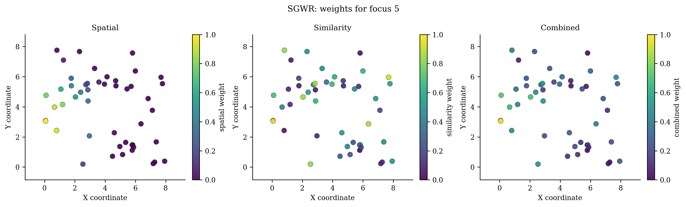
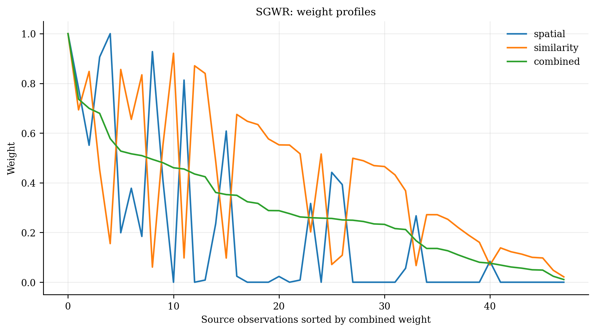

# Similarity and Geographically Weighted Regression (`SGWR`)

<div class="model-hero" markdown>

**Family:** Geography-plus-similarity regression
**Install:** `pip install -e ".[all]"`
**Required data:** X, y, coordinates, and similarity-variable specification
**Primary operations:** fit, predict, predict_result
**New-location capability:** Validated by recomputing geographic and attribute-similarity weights for targets.

</div>

[API reference](../api/models/sgwr.md){ .md-button .md-button--primary }
[Runnable source](https://github.com/hujinghaoabcd/pyGWRx/blob/main/examples/models/15_sgwr.py){ .md-button }
[Choose a model](../getting-started/choosing-a-model.md){ .md-button }

## Why this model exists

Use SGWR when physical proximity alone is not a sufficient definition of functional neighbourhood and attribute similarity has a defensible role.

!!! note "One-sentence idea"
    SGWR combines a geographic kernel with an attribute-similarity kernel. Distant observations can contribute when their selected contextual attributes are similar.

## Statistical formulation

For standardized similarity variables $z$, define

$$
d_{ij}^{A}=\frac{1}{m}\sum_k|z_{ik}-z_{jk}|,\qquad
w_{ij}^{A}=\exp[-(d_{ij}^{A})^2].
$$

The final weight is $w_{ij}=\alpha w_{ij}^{G}+(1-\alpha)w_{ij}^{A}$. At $\alpha=1$ the model reduces to geographic GWR.

## How pyGWRx fits the model

1. Choose variables that legitimately represent functional similarity.
2. Standardize similarity variables using training-data statistics.
3. Compute geographic and similarity weight matrices.
4. Apply or select the geographic bandwidth and alpha.
5. Combine weights and fit local weighted regressions.
6. For new targets, compute both weight components against the training sample.

## Constructor and important controls

```python
SGWR(bandwidth: 'Bandwidth' = 'aicc', adaptive: 'bool' = True, kernel: 'str' = 'bisquare', alpha: 'Alpha' = 'aicc', similarity_vars: 'Optional[Sequence[Union[int, str]]]' = None, *, standardize_similarity: 'bool' = True, bandwidth_kernel: 'Optional[str]' = None, bandwidth_range: 'Optional[Tuple[float, float]]' = None, alpha_range: 'Tuple[float, float]' = (0.01, 1.0), alpha_grid_size: 'int' = 21, fit_intercept: 'bool' = True, distance_metric: 'str' = 'euclidean', sigma2_v1: 'bool' = True, ridge: 'float' = 0.0, store_weights: 'bool' = True, verbose: 'bool' = False) -> 'None'
```

The API page documents every parameter and fitted attribute. In practice, start by deciding the **data contract**, **neighbourhood definition**, **selection criterion**, and **prediction/inference goal** before tuning secondary controls.

| Decision | Questions to answer |
|---|---|
| Data | Are rows independent observations, ordered stages, classes, counts, or multivariate features? |
| Distance | Are coordinates projected? Is time or contextual similarity part of the neighbourhood? |
| Bandwidth | Fixed distance or adaptive neighbours? Supplied value or selected criterion? |
| Inference | Are local uncertainty, non-stationarity tests, or only prediction required? |
| Validation | Does the split respect spatial and, where relevant, temporal dependence? |

## Complete runnable example

The following is the exact maintained example used by the API-coverage checks.

```python
# SPDX-FileCopyrightText: 2026 Jinghao Hu
# SPDX-License-Identifier: MIT

"""Fit similarity and geographically weighted regression."""

from pygwrx import SGWR
from _common import print_model_result, spatial_regression

X, y, coords = spatial_regression(n=48, p=3)
model = SGWR(
    bandwidth=24,
    adaptive=True,
    alpha=0.45,
    similarity_vars=["x1", "x2"],
    store_weights=True,
).fit(X, y, coords)
print_model_result(model)
print("combined_weights_shape=", model.combined_weights_.shape)
print("predictions=", model.predict(X.iloc[:3], coords.iloc[:3]))
```

Run it from the `examples/models` directory or through `python examples/run_all.py`.

## Reading the fitted result

**Main outputs:** Local coefficients and standard diagnostics plus selected alpha, similarity configuration, optional component/combined weights, predictions, and summaries.

Available high-level methods detected in the current class are: `fit()`, `predict()`, `predict_result()`, `summary()`.

A safe inspection sequence is:

```python
# 1. Human-readable overview
print(model.summary()) if hasattr(model, "summary") else None

# 2. Location-indexed table when supported
frame = model.to_frame() if hasattr(model, "to_frame") else None

# 3. Explicitly inspect the model-specific state
print([name for name in vars(model) if name.endswith("_")])
```

Do not assume that every model exposes the same outputs. Regression, classification, transformation, descriptive-statistics, and inference models have different result semantics.

## Diagnostics and interpretation

Decompose combined weights into geographic and similarity components, map how neighbour profiles change, and compare against pure GWR (`alpha=1`).

The common diagnostics layer can be used where the fitted model provides the required fields:

```python
from pygwrx.diagnostics import diagnostics_frame, local_diagnostic_frame

print(diagnostics_frame([model], labels=["SGWR"]))
try:
    print(local_diagnostic_frame(model).head())
except (AttributeError, NotImplementedError, ValueError) as exc:
    print("This model exposes a different diagnostic contract:", exc)
```

See [Diagnostics and inference](../guides/diagnostics.md) for model-aware checks and interpretation rules.

## Recommended visual checks


<div class="figure-grid" markdown>

<figure markdown>
  { loading=lazy }
  <figcaption>23 Sgwr Weights</figcaption>
</figure>

<figure markdown>
  { loading=lazy }
  <figcaption>24 Sgwr Profiles</figcaption>
</figure>

</div>


The figures are generated from deterministic examples and are illustrative; they are not benchmark claims.

## Common mistakes

- Using outcome-derived variables as similarity inputs and causing leakage.
- Choosing similarity variables only because they improve in-sample fit.
- Ignoring the dense long-range influence of the similarity kernel.
- Interpreting alpha without checking variable scaling.

## What to report in a paper or technical report

- Similarity variables and standardization.
- Similarity metric, alpha, and bandwidth-selection procedure.
- Weight decomposition and neighbour examples.
- Comparison with standard GWR.
- Validation that avoids feature or outcome leakage.

## References

- [Lessani & Li (2024), *SGWR: similarity and geographically weighted regression*](https://doi.org/10.1080/13658816.2024.2342319)
- [Yu et al. (2025), *Similarity and geographically weighted regression considering spatial scales of feature space*](https://doi.org/10.1016/j.spasta.2025.100897)

## Related documentation

- [Detailed API for `SGWR`](../api/models/sgwr.md)
- [Maintained example source](https://github.com/hujinghaoabcd/pyGWRx/blob/main/examples/models/15_sgwr.py)
- [Kernels and bandwidths](../guides/kernels-and-bandwidths.md)
- [Prediction and result objects](../guides/prediction-and-results.md)
- [Complete Chinese model guide](../zh/models/sgwr.md)
