# pyGWRx 可视化图库指南

所有图均由当前代码实际运行生成，共 47 张。`core/` 为 GWR/MGWR/LCRGWR 通用图，`specialized/` 为其他模型专用图。

## 1. 01 coefficient

- 文件：`figures/core/01_coefficient.png`
- SHA-256：`a6abd74b4294344dd3d195ba7db9176e98d6fe3d6baa925f4015dd99f61dd58c`

## 2. 02 coefficient significant

- 文件：`figures/core/02_coefficient_significant.png`
- SHA-256：`eb22bc38b681719c58c1d5479123baaa08767611226db9426fc0f9f3e08a1252`

## 3. 03 significance categories

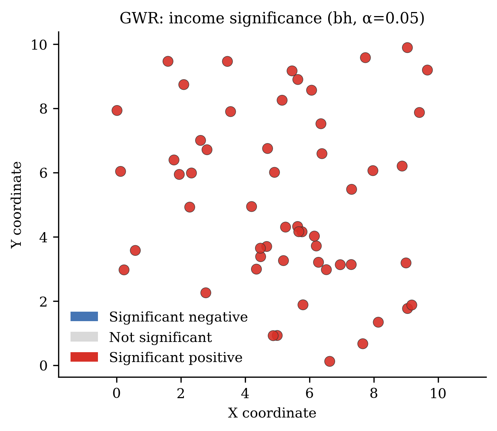

- 文件：`figures/core/03_significance_categories.png`
- SHA-256：`735786b1aa293c83779c2184d61a14d41244cb4d0f83ca2543ff5dd3e60d6eb7`

## 4. 04 local r2

- 文件：`figures/core/04_local_r2.png`
- SHA-256：`a22165be280e8594de3a613ece479d1a5e568626cc3ec59fcfe8dbf09f360d8d`

## 5. 05 standardized residual

- 文件：`figures/core/05_standardized_residual.png`
- SHA-256：`f977607fcb90e5a97055a261d619492a7bb3e7f281437979563b4d9b1897462a`

## 6. 06 cooks distance

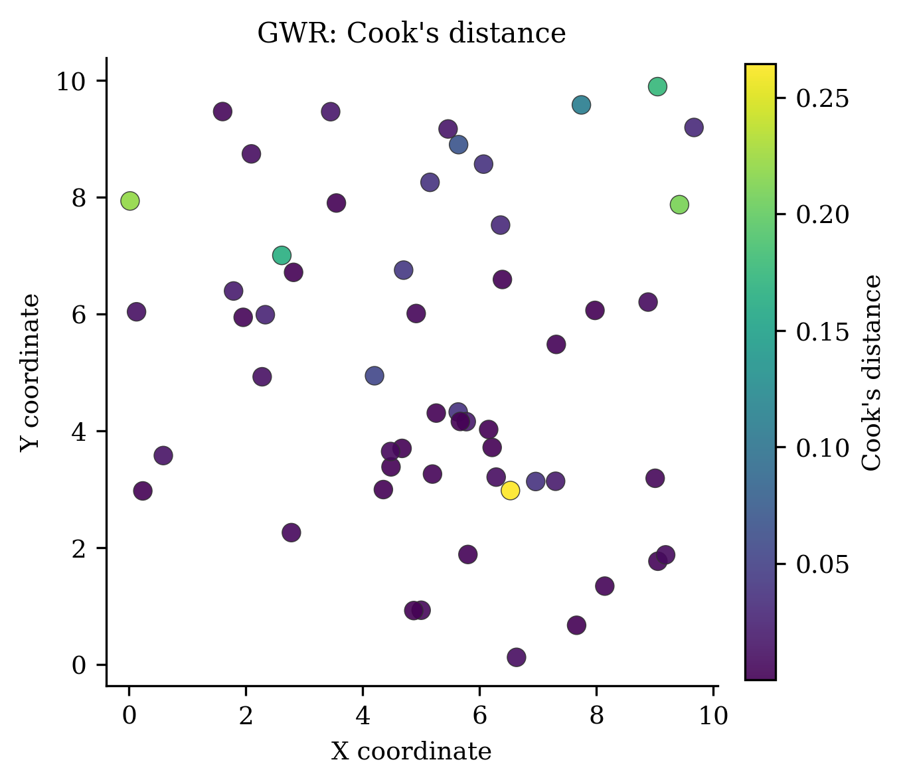

- 文件：`figures/core/06_cooks_distance.png`
- SHA-256：`97e596fe20593efcd097a07f84b5c21e16f3c9311486917fd8362488ed8087a8`

## 7. 07 gwr condition number

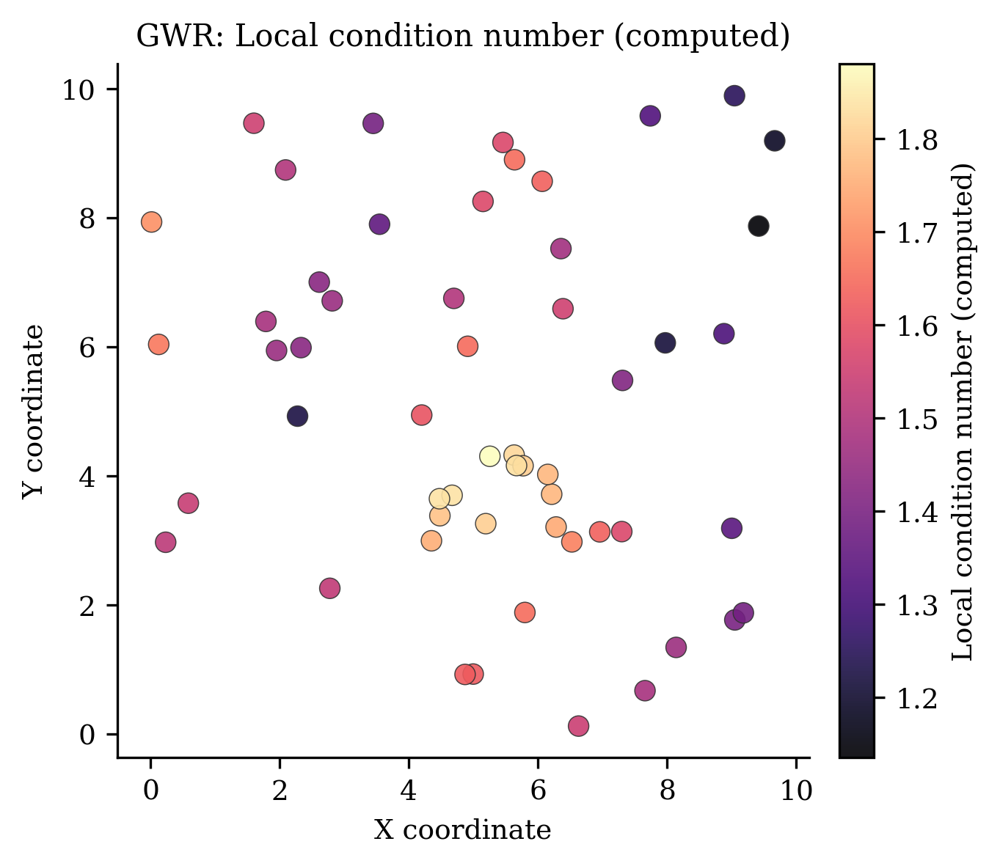

- 文件：`figures/core/07_gwr_condition_number.png`
- SHA-256：`e9d1145789846585f14b0abba929f5c52066abb142b110d3695ffdfdbb3fcd39`

## 8. 08 lcr lambda

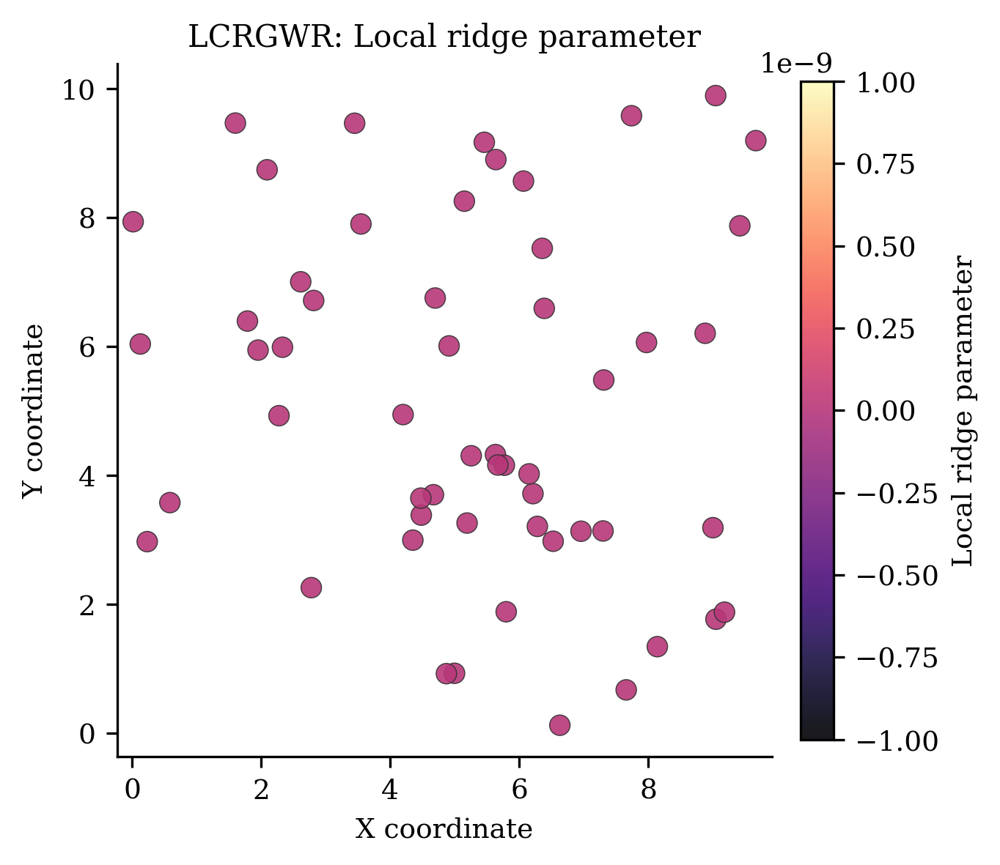

- 文件：`figures/core/08_lcr_lambda.png`
- SHA-256：`fcb534679d53d80e1107d5e59d0d95aafaff5711d7ef6c86a594ab1474ae5bec`

## 9. 09 mgwr bandwidths

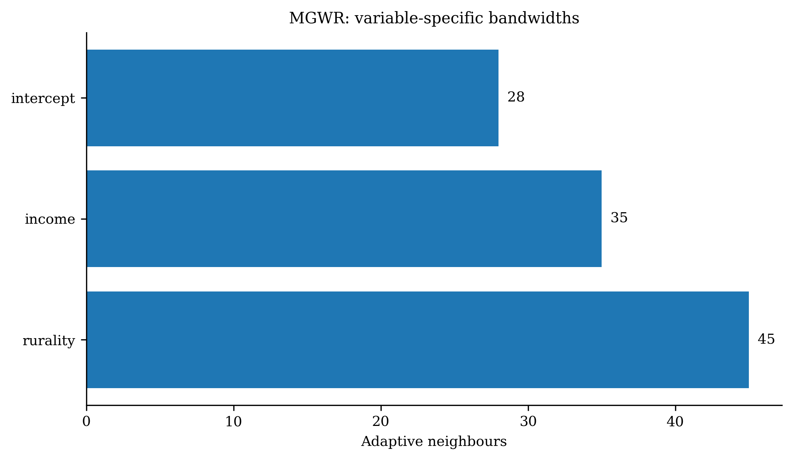

- 文件：`figures/core/09_mgwr_bandwidths.png`
- SHA-256：`c034132f9347f63da40cb0c0c333c82337d49b7bf085671ae5c8e9b377155224`

## 10. 10 kernel weights

- 文件：`figures/core/10_kernel_weights.png`
- SHA-256：`d2d4910c294268afb60d5d76b3d4a2328a1db27c313720b8824d98e2ad48c090`

## 11. 11 gwr mgwr comparison

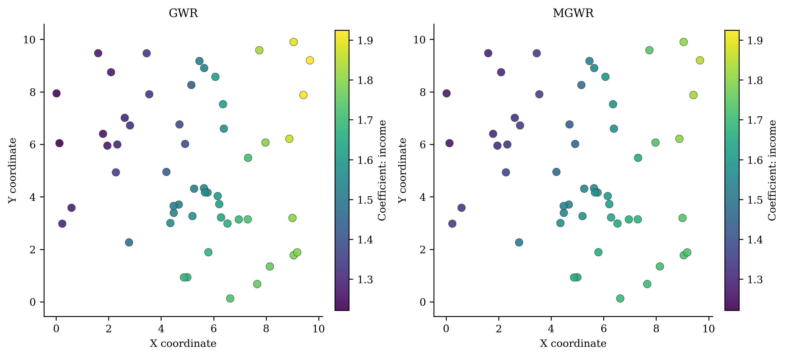

- 文件：`figures/core/11_gwr_mgwr_comparison.png`
- SHA-256：`b9ae9517b8e6396c3bf3fe24a5cdaa30c3ce1b0f8ca4c073c105e722284ba060`

## 12. 12 diagnostic panel

- 文件：`figures/core/12_diagnostic_panel.png`
- SHA-256：`e17065af98460a9ecec421b3a5900843907cd1cf07cd46bd797c9238c1e69958`

## 13. 01 rgwr weights

- 文件：`figures/specialized/01_rgwr_weights.png`
- SHA-256：`2fda0a5c25c592bbc64d0d060bcaaa54ba2ef0123a58bcbe3f5988dbed9dedae`

## 14. 02 rgwr convergence

- 文件：`figures/specialized/02_rgwr_convergence.png`
- SHA-256：`e96a1a313883f7a8408d9f218f5d82e7ca20ed4526de88f74184b18859de94b5`

## 15. 03 gwglm residuals

- 文件：`figures/specialized/03_gwglm_residuals.png`
- SHA-256：`065dcb1962d53e09caf3f89631026aebb89d4d5e4813a597390c57b21d6cf0c3`

## 16. 04 gwlasso frequency

- 文件：`figures/specialized/04_gwlasso_frequency.png`
- SHA-256：`4b8154a75ee40641e56f27da1388a9c0ee833db9e1083fd1d819049c3361d549`

## 17. 05 gwlasso active

- 文件：`figures/specialized/05_gwlasso_active.png`
- SHA-256：`80d3bca766a23a3fa361e377fedb462b675f7f634ef70592a004d8aec17a3424`

## 18. 06 gwlasso alpha

- 文件：`figures/specialized/06_gwlasso_alpha.png`
- SHA-256：`cf08f4df9094ce40de68529570f596f35a8668a3e57b9893d18376b6db8ca845`

## 19. 07 mixed coefficients

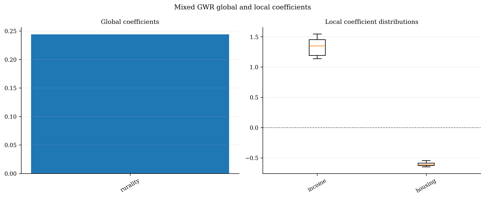

- 文件：`figures/specialized/07_mixed_coefficients.png`
- SHA-256：`da5762d2a3ed1059ee47022019e41ef5724bffa781345202ae8db8b2096d8931`

## 20. 08 bootstrap pvalues

- 文件：`figures/specialized/08_bootstrap_pvalues.png`
- SHA-256：`a039d4ace0715894b8e3f34a33777b0412ae53066f346dbf2522f9759a8898a9`

## 21. 09 bootstrap bandwidths

- 文件：`figures/specialized/09_bootstrap_bandwidths.png`
- SHA-256：`9af5f2b404bb774e1ef464555f822b89147343cd8e339fd4b6553252fabbfbc1`

## 22. 10 scalable kernel

- 文件：`figures/specialized/10_scalable_kernel.png`
- SHA-256：`2ca790a640c69e09352ffc7a2032afe33e1eea8abf04aa87f223575baac65d9b`

## 23. 11 gwss mean

- 文件：`figures/specialized/11_gwss_mean.png`
- SHA-256：`ba8d7d6ccf5d564bfbeecdddee69b02f90d23233e95a0794c05fc1e4288264d5`

## 24. 12 gwss correlation

- 文件：`figures/specialized/12_gwss_correlation.png`
- SHA-256：`00e53097dc94c2addf3357ee1bbe64baed7b8a300e146f543e6337b5ddc35bdc`

## 25. 13 gwpca variance

- 文件：`figures/specialized/13_gwpca_variance.png`
- SHA-256：`0ae306f5ad6fa7bb7eb250d8cb3bd17914e31b4b520ba3b1c60a9cc2f6c5d1df`

## 26. 14 gwpca loading

- 文件：`figures/specialized/14_gwpca_loading.png`
- SHA-256：`a1ef5fc072903b6705441af7e2ac873c535411c2980a78be618992a8ad73e660`

## 27. 15 gwda class

- 文件：`figures/specialized/15_gwda_class.png`
- SHA-256：`7e68ffb751245fcec695648dcb88590f263ccfb4f49f3918bc468b6cc31ca9c8`

## 28. 16 gwda confidence

- 文件：`figures/specialized/16_gwda_confidence.png`
- SHA-256：`4fd6d638630d91adfa17e3c4df9ec2b51a92df3833b8563c756ee67f911fd8ba`

## 29. 17 gwda confusion

- 文件：`figures/specialized/17_gwda_confusion.png`
- SHA-256：`16f297c0157dcf527b7331e5530f92c93685da3a7ccfe1a40f308b388e59ac5b`

## 30. 18 gtwr slices

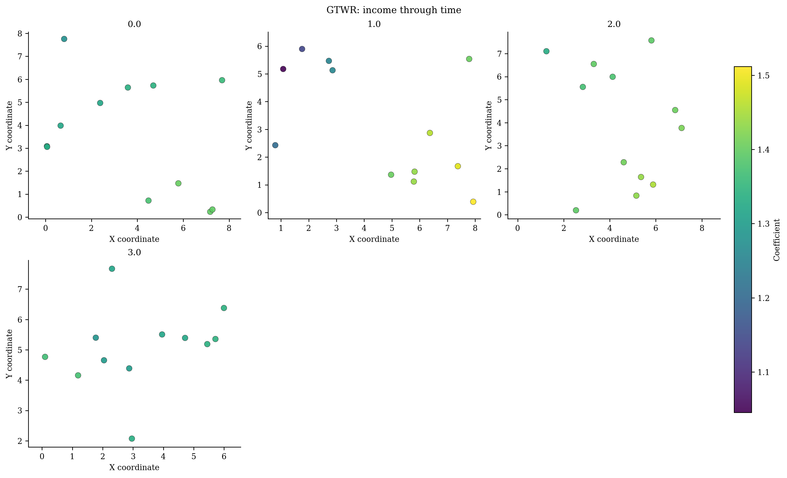

- 文件：`figures/specialized/18_gtwr_slices.png`
- SHA-256：`b8b21a5cee15a4f67b0dc375f4676cc5d87c4c8660dad925f44e1c9dfd67258a`

## 31. 19 gtwr trajectory

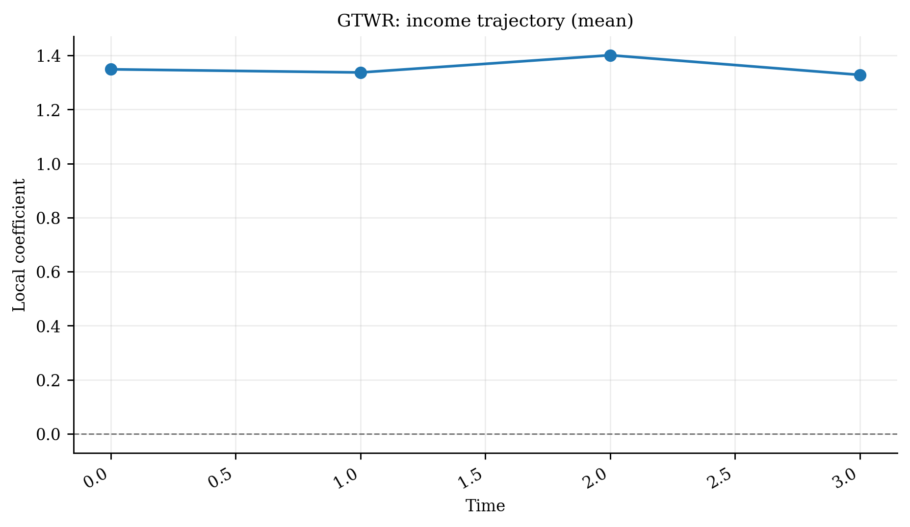

- 文件：`figures/specialized/19_gtwr_trajectory.png`
- SHA-256：`d5f027773d53c06a2825164c5fd9ac9699e9ae370ee36aca1def6c1458c77070`

## 32. 20 gtwr residuals

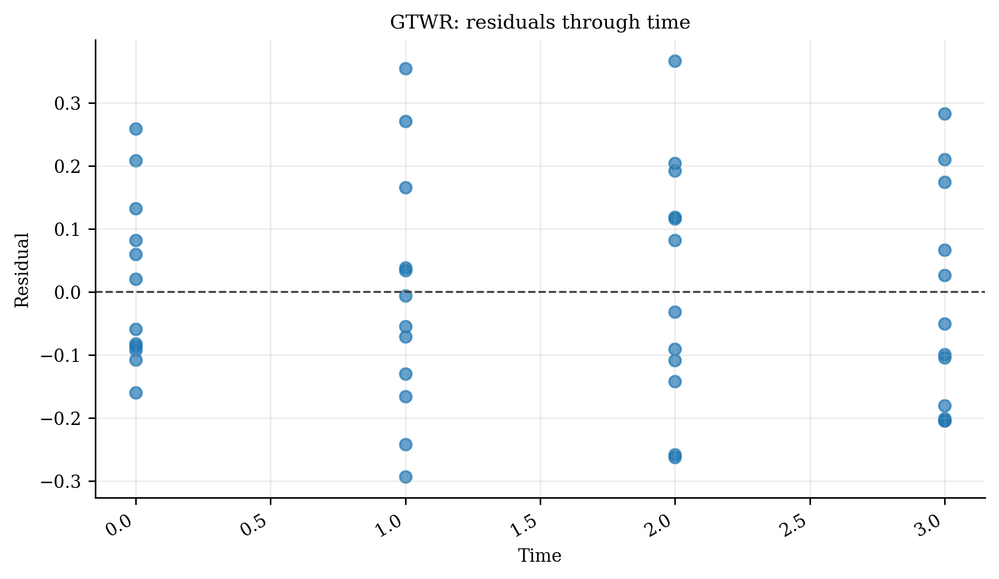

- 文件：`figures/specialized/20_gtwr_residuals.png`
- SHA-256：`2148203de5de06f26fcf9777fcb83dd02fa5db222209d5f319cb88e18b39f583`

## 33. 21 mgtwr scales

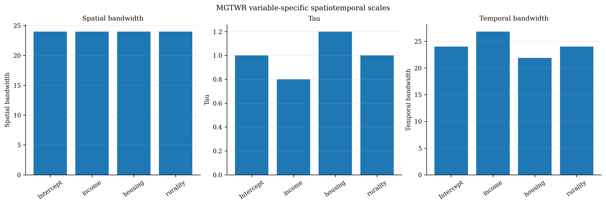

- 文件：`figures/specialized/21_mgtwr_scales.png`
- SHA-256：`46f3ecfd2f8fa557342101951212e63a73df9219a9ad364f17c293f43371ceef`

## 34. 22 sgtwr scales

- 文件：`figures/specialized/22_sgtwr_scales.png`
- SHA-256：`451d5eec0517a683800b7ffc4ee76145fdea7c5517f5d9a94341fc209455b988`

## 35. 23 sgwr weights

- 文件：`figures/specialized/23_sgwr_weights.png`
- SHA-256：`d60ee2cd325a1dfa31bdbd8a3491f8c814f051b52196bdf3ea42c3b46a125e2a`

## 36. 24 sgwr profiles

- 文件：`figures/specialized/24_sgwr_profiles.png`
- SHA-256：`ed6baca578b6ef8d5c834693016413781e82b81e88c2c232fd963ca2e34dcdf9`

## 37. 25 stwr weights

- 文件：`figures/specialized/25_stwr_weights.png`
- SHA-256：`559414b005c95d61c59627f55157236e4819e2d91bdc1d884613b5322fd1884c`

## 38. 26 sgtwr weights

- 文件：`figures/specialized/26_sgtwr_weights.png`
- SHA-256：`06fd160f89fbf8475f780a88d859d3627fc38f4219ec91ce29f1f7d066302438`

## 39. 27 lggwr latent

- 文件：`figures/specialized/27_lggwr_latent.png`
- SHA-256：`40d6f0532e2dc9a0d1c2324eec1fd6b8762e4ef20d8cba8efb636ffe7021e76d`

## 40. 28 lggwr metric

- 文件：`figures/specialized/28_lggwr_metric.png`
- SHA-256：`5d2698ed851a444371ca57a7b14b8e2938e42aa3ea08f493efdf676d5cfcfa32`

## 41. 29 lggwr training

- 文件：`figures/specialized/29_lggwr_training.png`
- SHA-256：`37e56da9d1a6781071b12ee9c45c0ed2c0af53a7d2ba9c384e29891a180b25da`

## 42. 30 lggwr neighbours

- 文件：`figures/specialized/30_lggwr_neighbours.png`
- SHA-256：`00c85eef237e74b212dd9a58dfd678b98d81883ea88dfe8fa9c9ee1bf4b2a988`

## 43. 31 grgwr regimes

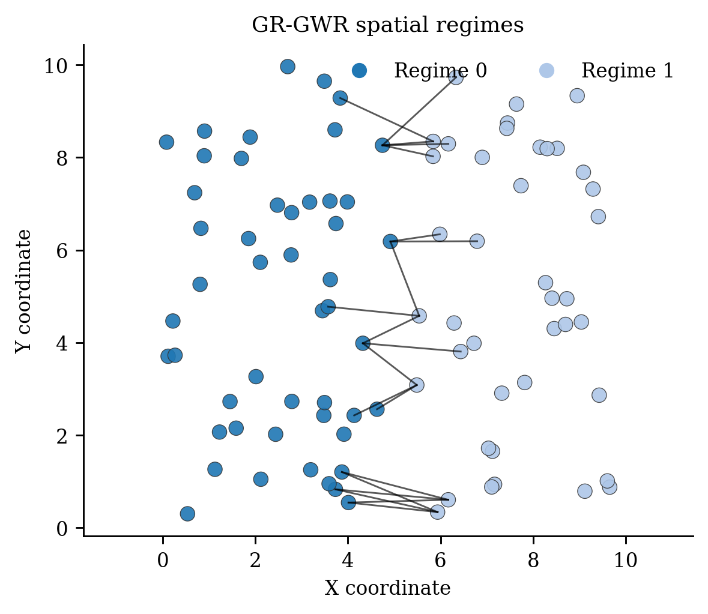

- 文件：`figures/specialized/31_grgwr_regimes.png`
- SHA-256：`a93006a8a95e8ec7181cd1830ed78d2e5f6c3c6190eef85a73aa949af846701b`

## 44. 32 grgwr convergence

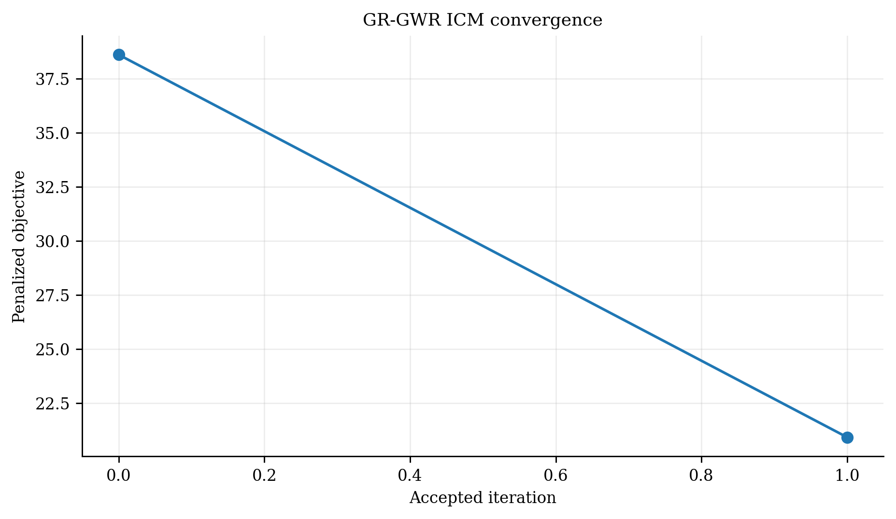

- 文件：`figures/specialized/32_grgwr_convergence.png`
- SHA-256：`ccf252e7d60b911c6d806861eff97a66510b4df9b25427510a81b927aca2beec`

## 45. 33 grgwr sizes

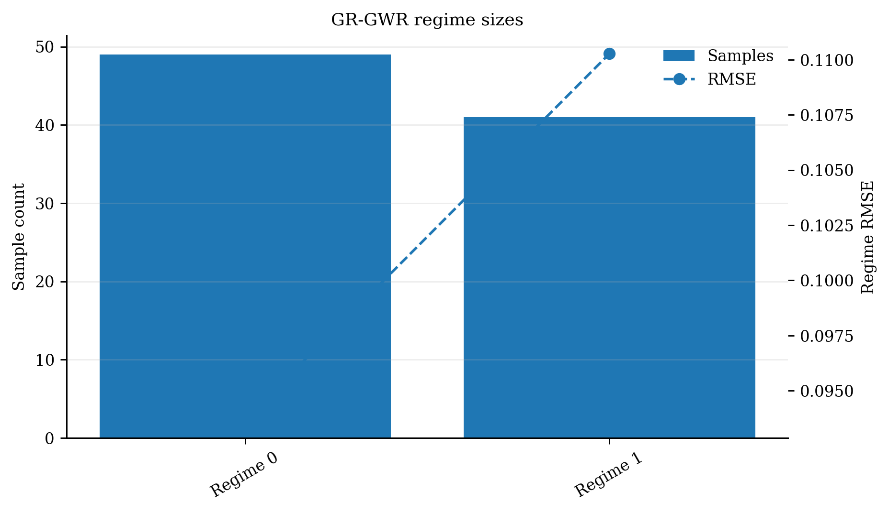

- 文件：`figures/specialized/33_grgwr_sizes.png`
- SHA-256：`de99d7df9eeda8ddde1cc31d218c5bfc5b0898ea92481d099cb5fc578bb2b039`

## 46. 34 grgwr coefficient

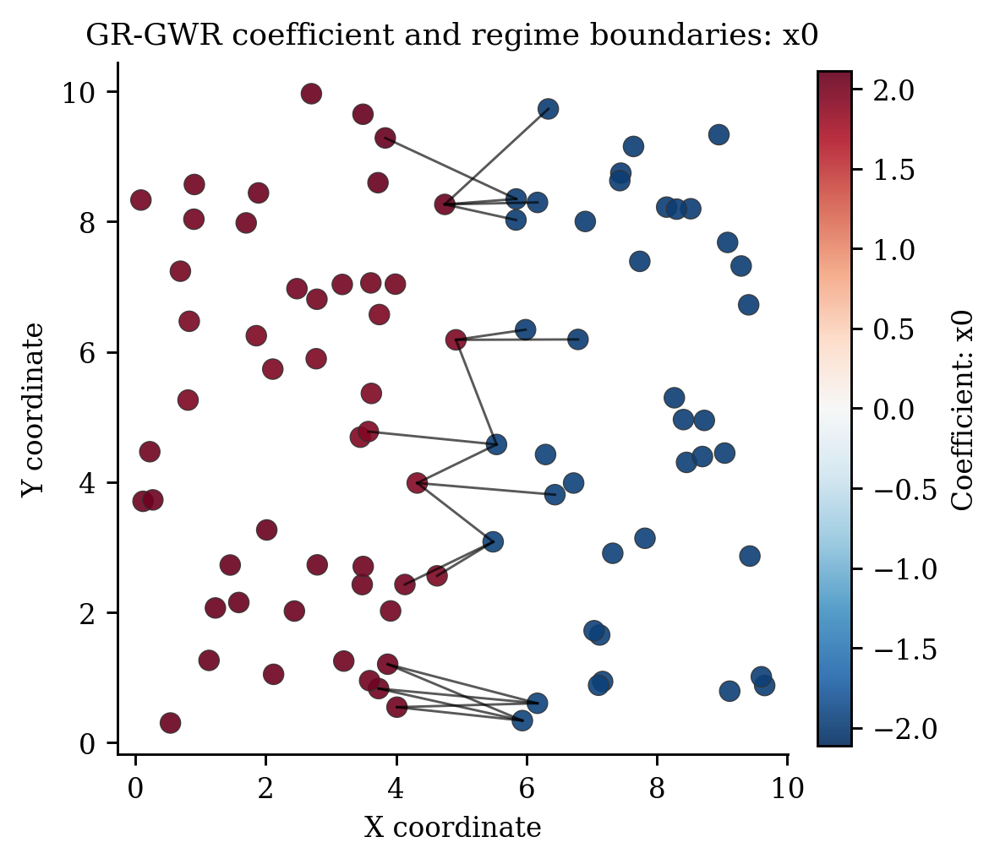

- 文件：`figures/specialized/34_grgwr_coefficient.png`
- SHA-256：`bec3d4d5e6dcee90109be439ef30dd04a575b987eb2e381744f9faca2e0de36a`

## 47. 35 model diagnostics

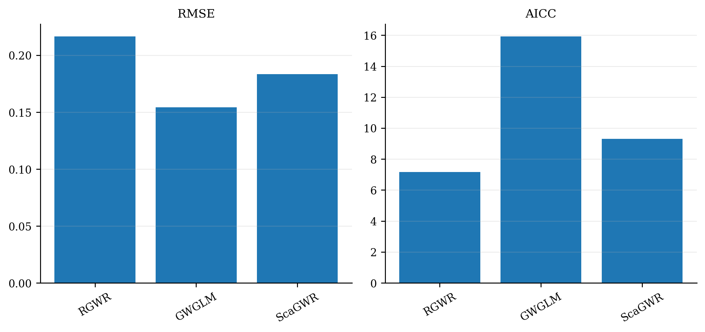

- 文件：`figures/specialized/35_model_diagnostics.png`
- SHA-256：`247d4926c10890b61ae55ea8327b6ebcb3a409fe19816373f886fd2bae4f1e29`
