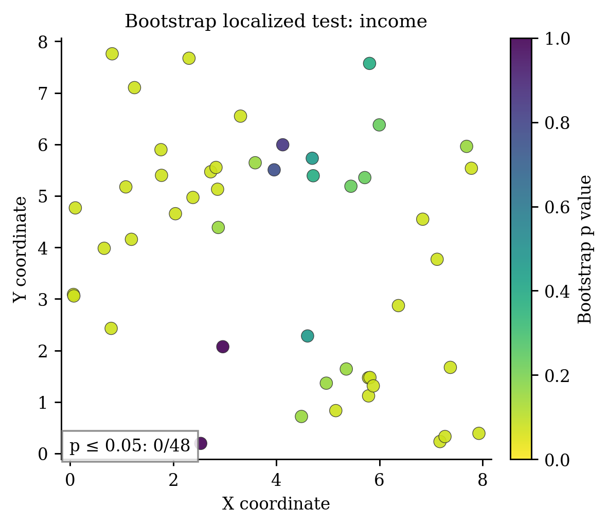
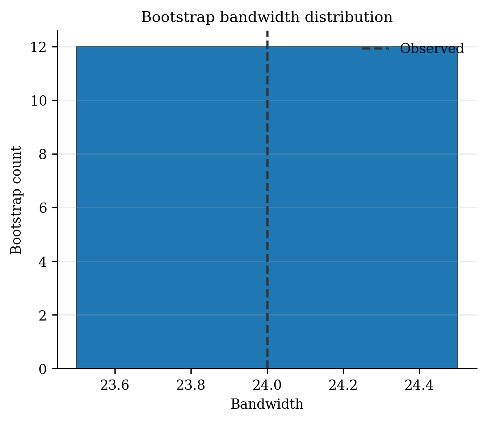

# Bootstrap Tests for GWR Non-stationarity（`BootstrapGWR`）

> **pyGWRx 模型编号 12｜类别：空间非平稳统计检验**
> 本文同时说明原始方法与当前 pyGWRx 实现。凡实现与论文求解器不同之处均会明确指出。

方法来源：[Harris et al. (2017), *Introducing bootstrap methods to investigate coefficient non-stationarity*](https://doi.org/10.1016/j.spasta.2017.07.006)。


## 1. 模型要解决的核心问题

空间统计中最危险的假设之一，是默认一组回归关系在整个研究区完全相同。若某个变量在城市中心、郊区、沿海和山区产生不同影响，一个全局系数只能给出平均效应，局部差异会被平均掉。地理加权方法的共同思想是：在每个目标位置建立一个局部窗口，让距离更近、时间更近、属性更相似或属于同一机制的观测获得更高权重，再估计该位置的局部统计量或局部模型。

需要强调：局部模型不是自动的因果模型。它首先是一种用于描述、探索和预测空间异质性的工具。带宽、核函数、局部共线性、异常值、残差空间相关和多重检验均会改变解释，必须与诊断一起使用。


## 2. 一句话思想

看到系数地图有起伏，不等于真实非平稳。BootstrapGWR 在“全局系数不变”的零假设下反复生成数据，判断观察到的局部系数波动是否大于随机噪声可解释的程度。

## 3. 数学模型

先拟合零假设 OLS：

$$
y=X\hat\beta_{OLS}+\varepsilon,
\qquad \hat\varepsilon\sim(0,\hat\sigma^2).
$$

第 $b$ 次参数 bootstrap 为

$$
y^{*(b)}=X\hat\beta_{OLS}+\varepsilon^{*(b)},
\qquad \varepsilon^{*(b)}\sim N(0,\hat\sigma^2).
$$

每个样本重新拟合 GWR。全局修正统计量可取局部 pseudo-$t$ 面的空间标准差：

$$
T_k=\operatorname{SD}_i\left(\frac{\hat\beta_{ik}}{\widehat{SE}_{ik}}\right).
$$

有限样本 plus-one p 值为

$$
p_k=\frac{1+\sum_b\mathbf1(T_k^{*(b)}\ge T_k)}{B+1}.
$$

## 4. 算法流程

1. 拟合 OLS 零模型与原始 GWR。
2. 计算观察统计量。
3. 从零模型生成 bootstrap 响应。
4. 每次可重新选择带宽并拟合 GWR。
5. 形成全局和局部分布，计算 plus-one p 值。
6. 报告 Monte Carlo 误差并进行多重检验校正。

## 5. pyGWRx 当前实现

```python
from pygwrx import BootstrapGWR

model = BootstrapGWR(bandwidth='aicc', adaptive=False, kernel='bisquare', n_bootstrap=99, reselect_bandwidth=True, pvalue_method='plus_one', localized_tail='two-sided', ... )
```

pyGWRx 固定使用已经验证的 OLS 参数零模型，同时计算系数级修正统计量和局部统计量；支持带宽重选、双侧或右尾局部比较、随机种子以及可选保存局部 bootstrap 数组。未验证的空间误差、空间滞后等零模型不作为公共参数暴露。

### 5.1 输入语义

- `X`：自变量矩阵；启用 `fit_intercept=True` 时由模型统一添加截距。
- `y`：响应或类别，具体形状和分布要求由模型决定。
- `coords`：校准位置坐标；经纬度数据在使用欧氏距离前应投影，或选择模型支持的相应距离语义。
- 带宽：固定模式表示距离阈值，自适应模式通常表示近邻数量；两者不能混为同一单位。

### 5.2 结果与诊断

应优先检查：拟合值与残差、局部系数、带宽或尺度、有效参数个数、AICc/CV、标准误与显著性、局部共线性、影响度、残差空间结构。模型专用结果请结合下方图件和 `pygwrx.diagnostics` 使用。

## 6. 适用场景

需要判断某个系数面是否真的空间变化，而不是仅展示地图时使用。

## 7. 关键局限与误用风险

计算量约为 $B$ 次完整 GWR；p 值精度受 $B$ 限制；零模型若遗漏空间误差会影响检验；局部检验仍需校正。

## 8. 推荐可视化





## 9. 最小工作流

```python
# 以下是接口结构示意；不同模型的 fit 参数可能包括 times、attributes 或阶段列表。
model = BootstrapGWR(...)
model.fit(X, y, coords)

# 常见结果
# model.fitted_values_
# model.residuals_
# model.local_parameters_ / model.coef_
# model.diagnostics_
```

推荐工作顺序：全局模型 → 带宽/尺度选择 → 局部拟合 → 推断校正 → 局部共线性和影响诊断 → 空间分块验证 → 图件与结论。

## 10. 主要参考资料

- [Harris et al. (2017), *Introducing bootstrap methods to investigate coefficient non-stationarity*](https://doi.org/10.1016/j.spasta.2017.07.006)
- [Brunsdon, Fotheringham & Charlton (1996), *Geographically Weighted Regression: A Method for Exploring Spatial Nonstationarity*](https://doi.org/10.1111/j.1538-4632.1996.tb00936.x)

---

**版本说明：** 本文依据当前 pyGWRx 0.1.2 Alpha 源码与算法知识库整理。它描述的是当前已验证实现，而不是对任意同名软件的泛化说明。


## 11. 当前能力边界

- **输入：** X, y, coordinates
- **主要操作：** fit, summary, to_frame
- **新位置能力：** Not applicable; the estimator performs coefficient-variability inference.
- **安装分组：** `base`
- **英文模型指南：** [打开](../../models/bootstrap-gwr.md)
- **API：** [打开](../../api/models/bootstrap-gwr.md)

## 12. 完整可运行示例

```python
# SPDX-FileCopyrightText: 2026 Jinghao Hu
# SPDX-License-Identifier: MIT

"""Run coefficient-wise bootstrap tests for spatial variability."""

from pygwrx import BootstrapGWR
from _common import print_model_result, spatial_regression

X, y, coords = spatial_regression(n=42, p=2)
model = BootstrapGWR(
    bandwidth=22,
    adaptive=True,
    n_bootstrap=9,
    reselect_bandwidth=False,
    store_local_bootstrap=True,
    random_state=0,
).fit(X, y, coords)
print_model_result(model)
print("modified_pvalues=", model.modified_p_values_)
print("localized_p_values_shape=", model.localized_p_values_.shape)
```

该脚本是项目 API—示例覆盖检查所使用的正式示例，可通过 `python examples/run_all.py` 批量运行。
