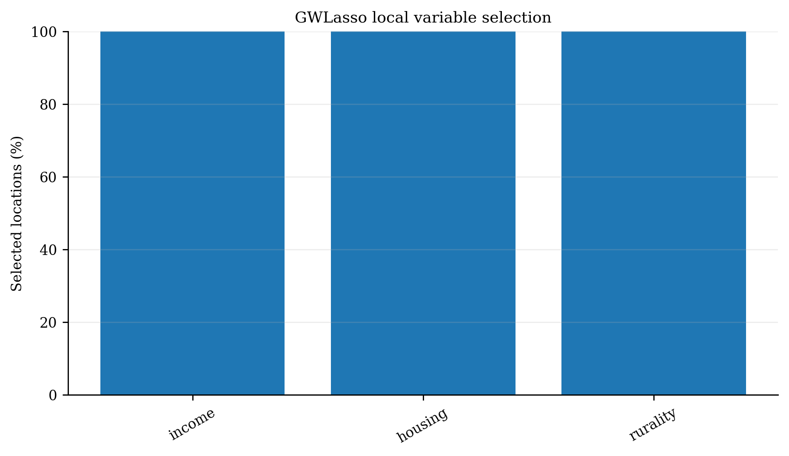
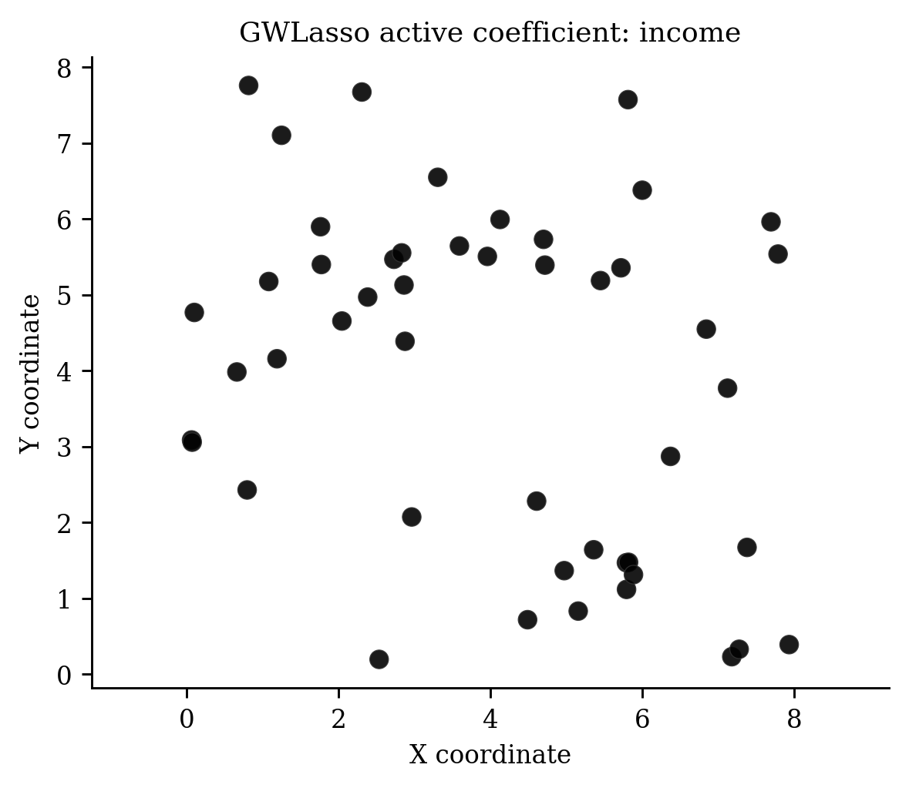
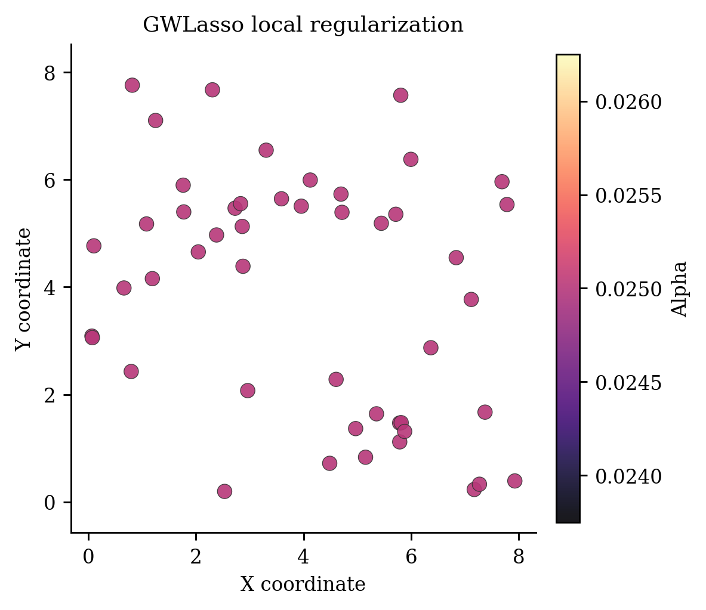

# Geographically Weighted Lasso（`GWLasso`）

> **pyGWRx 模型编号 17｜类别：局部稀疏回归**
> 本文同时说明原始方法与当前 pyGWRx 实现。凡实现与论文求解器不同之处均会明确指出。

正式来源：[Wheeler (2009), *The Geographically Weighted Lasso*](https://doi.org/10.1068/a40256)。


## 1. 模型要解决的核心问题

空间统计中最危险的假设之一，是默认一组回归关系在整个研究区完全相同。若某个变量在城市中心、郊区、沿海和山区产生不同影响，一个全局系数只能给出平均效应，局部差异会被平均掉。地理加权方法的共同思想是：在每个目标位置建立一个局部窗口，让距离更近、时间更近、属性更相似或属于同一机制的观测获得更高权重，再估计该位置的局部统计量或局部模型。

需要强调：局部模型不是自动的因果模型。它首先是一种用于描述、探索和预测空间异质性的工具。带宽、核函数、局部共线性、异常值、残差空间相关和多重检验均会改变解释，必须与诊断一起使用。


## 2. 一句话思想

不同地区可能不仅系数大小不同，真正起作用的变量集合也不同。GWLasso 在每个位置做带地理权重的 L1 正则化，使部分局部系数精确收缩到零。

## 3. 数学模型

位置 $s$ 的局部目标为

$$
\min_{\beta_0(s),\beta(s)}
\frac{1}{2\sum_iw_i(s)}
\sum_iw_i(s)\left[y_i-\beta_0(s)-x_i^\top\beta(s)\right]^2
+\lambda(s)\|\beta(s)\|_1.
$$

截距不惩罚。为让惩罚可比较，局部自变量通常按加权均值和加权尺度标准化，再将系数还原到原始量纲。KKT 条件决定某个局部系数是否为零。

## 4. 算法流程

1. 确定地理带宽。
2. 在每个目标位置计算空间权重。
3. 对局部 X、y 进行加权中心化和标准化。
4. 通过局部 CV 或给定 alpha 选择惩罚。
5. 坐标下降求解局部 Lasso。
6. 还原系数，绘制变量激活区域和选择频率。

## 5. pyGWRx 当前实现

```python
from pygwrx import GWLasso

model = GWLasso(kernel='exponential', bandwidth='cv', alpha='cv', alpha_grid=None, n_alphas=30, cv_folds=5, standardize=True, adaptive=False, ...)
```

pyGWRx 支持全局或局部 alpha、局部标准化、截距不惩罚、alpha 网格和交叉验证、变量重要性与活跃矩阵。

### 5.1 输入语义

- `X`：自变量矩阵；启用 `fit_intercept=True` 时由模型统一添加截距。
- `y`：响应或类别，具体形状和分布要求由模型决定。
- `coords`：校准位置坐标；经纬度数据在使用欧氏距离前应投影，或选择模型支持的相应距离语义。
- 带宽：固定模式表示距离阈值，自适应模式通常表示近邻数量；两者不能混为同一单位。

### 5.2 结果与诊断

应优先检查：拟合值与残差、局部系数、带宽或尺度、有效参数个数、AICc/CV、标准误与显著性、局部共线性、影响度、残差空间结构。模型专用结果请结合下方图件和 `pygwrx.diagnostics` 使用。

## 6. 适用场景

解释变量较多、局部共线性明显、需要识别“哪里哪些变量有效”时使用。

## 7. 关键局限与误用风险

Lasso 在高度相关变量中可能任意选择一个；局部选择结果可不稳定；alpha 与空间带宽共同决定稀疏度；常规标准误不适用于选择后的系数。

## 8. 推荐可视化







## 9. 最小工作流

```python
# 以下是接口结构示意；不同模型的 fit 参数可能包括 times、attributes 或阶段列表。
model = GWLasso(...)
model.fit(X, y, coords)

# 常见结果
# model.fitted_values_
# model.residuals_
# model.local_parameters_ / model.coef_
# model.diagnostics_
```

推荐工作顺序：全局模型 → 带宽/尺度选择 → 局部拟合 → 推断校正 → 局部共线性和影响诊断 → 空间分块验证 → 图件与结论。

## 10. 主要参考资料

- [Wheeler (2009), *The Geographically Weighted Lasso*](https://doi.org/10.1068/a40256)

---

**版本说明：** 本文依据当前 pyGWRx 0.1.2 Alpha 源码与算法知识库整理。它描述的是当前已验证实现，而不是对任意同名软件的泛化说明。


## 11. 当前能力边界

- **输入：** X, y, coordinates
- **主要操作：** fit, score, predict
- **新位置能力：** Validated local prediction with the learned local penalties and scaling state.
- **安装分组：** `ml`
- **英文模型指南：** [打开](../../models/gw-lasso.md)
- **API：** [打开](../../api/models/gw-lasso.md)

## 12. 完整可运行示例

```python
# SPDX-FileCopyrightText: 2026 Jinghao Hu
# SPDX-License-Identifier: MIT

"""Fit geographically weighted Lasso with a fixed local penalty."""

from pygwrx import GWLasso
from _common import print_model_result, spatial_regression

X, y, coords = spatial_regression(n=48, p=3)
model = GWLasso(
    bandwidth=24, adaptive=True, alpha=0.06, max_iter=1000, random_state=0
).fit(X, y, coords)
print_model_result(model)
print("selection_frequency=", model.selection_frequency_)
print("predictions=", model.predict(X.iloc[:3], coords.iloc[:3]))
```

该脚本是项目 API—示例覆盖检查所使用的正式示例，可通过 `python examples/run_all.py` 批量运行。
