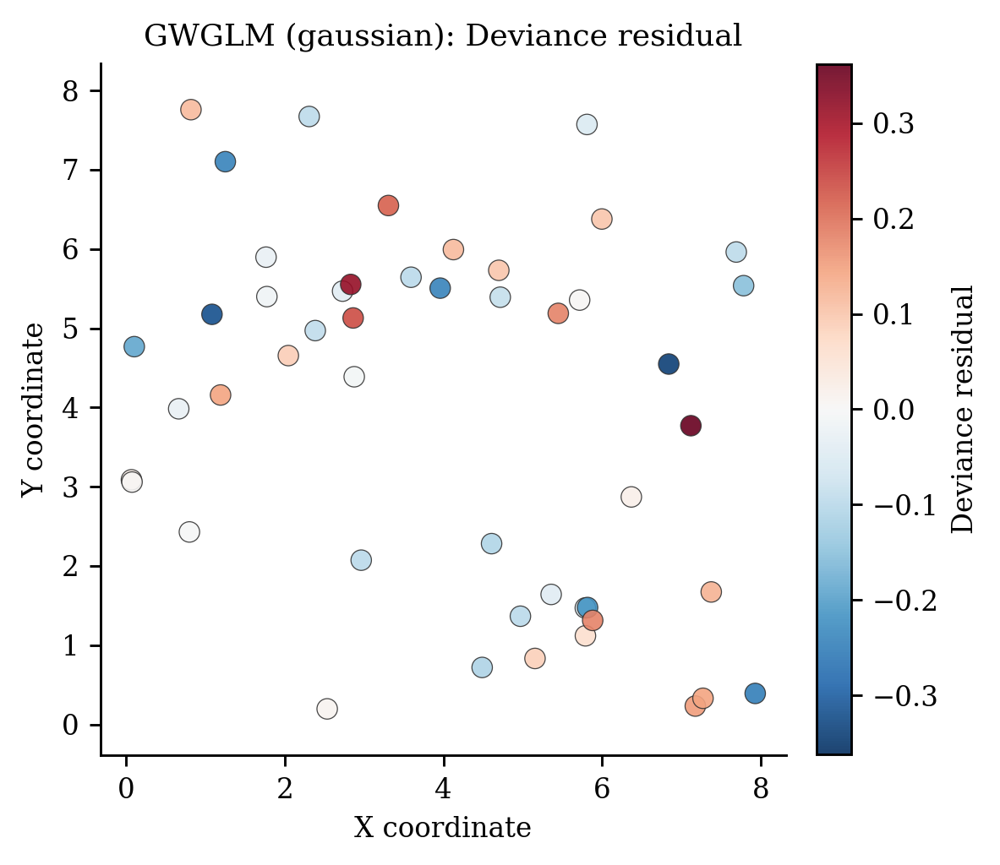

# Geographically Weighted Generalized Linear Models（`GWGLM`）

> **pyGWRx 模型编号 05｜类别：非高斯局部回归**
> 本文同时说明原始方法与当前 pyGWRx 实现。凡实现与论文求解器不同之处均会明确指出。

计数响应的重要基础来源：[Nakaya et al. (2005), *Geographically weighted Poisson regression for disease association mapping*](https://doi.org/10.1002/sim.2129)。


## 1. 模型要解决的核心问题

空间统计中最危险的假设之一，是默认一组回归关系在整个研究区完全相同。若某个变量在城市中心、郊区、沿海和山区产生不同影响，一个全局系数只能给出平均效应，局部差异会被平均掉。地理加权方法的共同思想是：在每个目标位置建立一个局部窗口，让距离更近、时间更近、属性更相似或属于同一机制的观测获得更高权重，再估计该位置的局部统计量或局部模型。

需要强调：局部模型不是自动的因果模型。它首先是一种用于描述、探索和预测空间异质性的工具。带宽、核函数、局部共线性、异常值、残差空间相关和多重检验均会改变解释，必须与诊断一起使用。


## 2. 一句话思想

将 GWR 的空间局部化与 GLM 的链接函数和方差函数结合，使计数、比例和二元结果也可具有空间变化系数。

## 3. 数学模型

对位置 $s_i$，局部线性预测子为

$$
\eta_j(s_i)=x_j^\top\beta(s_i),\qquad
\mu_j(s_i)=g^{-1}(\eta_j(s_i)).
$$

局部对数似然由空间权重加权：

$$
\ell_i(\beta)=\sum_j w_{ij}\,\ell(y_j;\mu_j,\phi).
$$

IWLS 第 $t$ 步形成工作响应和工作权重

$$
z_j^{(t)}=\eta_j^{(t)}+(y_j-\mu_j^{(t)})\frac{d\eta}{d\mu},
$$

$$
\omega_{ij}^{(t)}=w_{ij}\left[\operatorname{Var}(Y_j)
\left(\frac{d\eta}{d\mu}\right)^2\right]^{-1},
$$

再做加权最小二乘更新。

## 4. 算法流程

1. 选择 Gaussian/Poisson/Binomial 家族及链接。
2. 选择空间核与带宽。
3. 在每个目标位置进行局部 IWLS。
4. 用离差、对数似然和 AICc 选择带宽并检查收敛。
5. 输出均值尺度预测、Pearson/Deviance 残差和局部系数。

## 5. pyGWRx 当前实现

```python
from pygwrx import GWGLM

model = GWGLM(family='gaussian', kernel='bisquare', bandwidth='cv', bandwidth_method='aicc', adaptive=False, max_iter=100, tol=1e-6, ...)
```

pyGWRx 支持 Gaussian identity、Poisson log 和 Binomial logit。非高斯模型使用局部 IWLS，提供曝光量/offset 语义、离差残差、预测概率或期望计数，并对不收敛和非法响应做严格检查。

### 5.1 输入语义

- `X`：自变量矩阵；启用 `fit_intercept=True` 时由模型统一添加截距。
- `y`：响应或类别，具体形状和分布要求由模型决定。
- `coords`：校准位置坐标；经纬度数据在使用欧氏距离前应投影，或选择模型支持的相应距离语义。
- 带宽：固定模式表示距离阈值，自适应模式通常表示近邻数量；两者不能混为同一单位。

### 5.2 结果与诊断

应优先检查：拟合值与残差、局部系数、带宽或尺度、有效参数个数、AICc/CV、标准误与显著性、局部共线性、影响度、残差空间结构。模型专用结果请结合下方图件和 `pygwrx.diagnostics` 使用。

## 6. 适用场景

事件计数、疾病发生数、二元分类概率或比例结果具有空间异质性时使用。

## 7. 关键局限与误用风险

局部稀有事件会导致分离或奇异；Poisson 过度离散需额外模型；局部样本必须覆盖响应类别；IWLS 的带宽搜索成本高；不可把概率地图直接解释为因果风险。

## 8. 推荐可视化



## 9. 最小工作流

```python
# 以下是接口结构示意；不同模型的 fit 参数可能包括 times、attributes 或阶段列表。
model = GWGLM(...)
model.fit(X, y, coords)

# 常见结果
# model.fitted_values_
# model.residuals_
# model.local_parameters_ / model.coef_
# model.diagnostics_
```

推荐工作顺序：全局模型 → 带宽/尺度选择 → 局部拟合 → 推断校正 → 局部共线性和影响诊断 → 空间分块验证 → 图件与结论。

## 10. 主要参考资料

- [Nakaya et al. (2005), *Geographically weighted Poisson regression for disease association mapping*](https://doi.org/10.1002/sim.2129)
- [Gollini et al. (2015), *GWmodel: an R Package for Exploring Spatial Heterogeneity*](https://doi.org/10.18637/jss.v063.i17)

---

**版本说明：** 本文依据当前 pyGWRx 0.1.2 Alpha 源码与算法知识库整理。它描述的是当前已验证实现，而不是对任意同名软件的泛化说明。


## 11. 当前能力边界

- **输入：** X, response, coordinates; optional exposure for Poisson
- **主要操作：** fit, score, predict, predict_result
- **新位置能力：** Validated for Gaussian means, binomial probabilities, and Poisson means.
- **安装分组：** `base`
- **英文模型指南：** [打开](../../models/gwglm.md)
- **API：** [打开](../../api/models/gwglm.md)

## 12. 完整可运行示例

```python
# SPDX-FileCopyrightText: 2026 Jinghao Hu
# SPDX-License-Identifier: MIT

"""Fit Gaussian, binomial, and Poisson GWGLM families."""

import numpy as np
from pygwrx import GWGLM, GWGLMPredictionResult
from _common import count_regression, print_model_result, spatial_regression

X, y, coords = spatial_regression(p=2)
gaussian = GWGLM(family="gaussian", bandwidth=24, adaptive=True).fit(X, y, coords)
print_model_result(gaussian)

binary = (y > np.median(y)).astype(int)
binomial = GWGLM(family="binomial", bandwidth=24, adaptive=True).fit(X, binary, coords)
binomial_result = binomial.predict_result(X.iloc[:3], coords.iloc[:3])
assert isinstance(binomial_result, GWGLMPredictionResult)
print(binomial_result.to_frame())

Xc, counts, coordsc, exposure = count_regression()
poisson = GWGLM(family="poisson", bandwidth=24, adaptive=True).fit(
    Xc, counts, coordsc, exposure=exposure
)
print(
    "poisson means=",
    poisson.predict(Xc.iloc[:3], coordsc.iloc[:3], exposure=exposure[:3]),
)
```

该脚本是项目 API—示例覆盖检查所使用的正式示例，可通过 `python examples/run_all.py` 批量运行。
