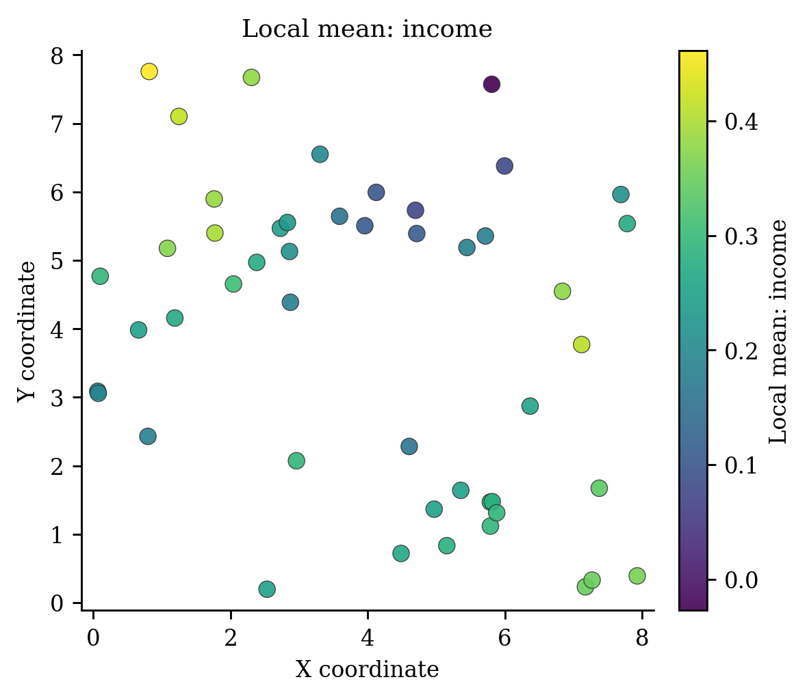
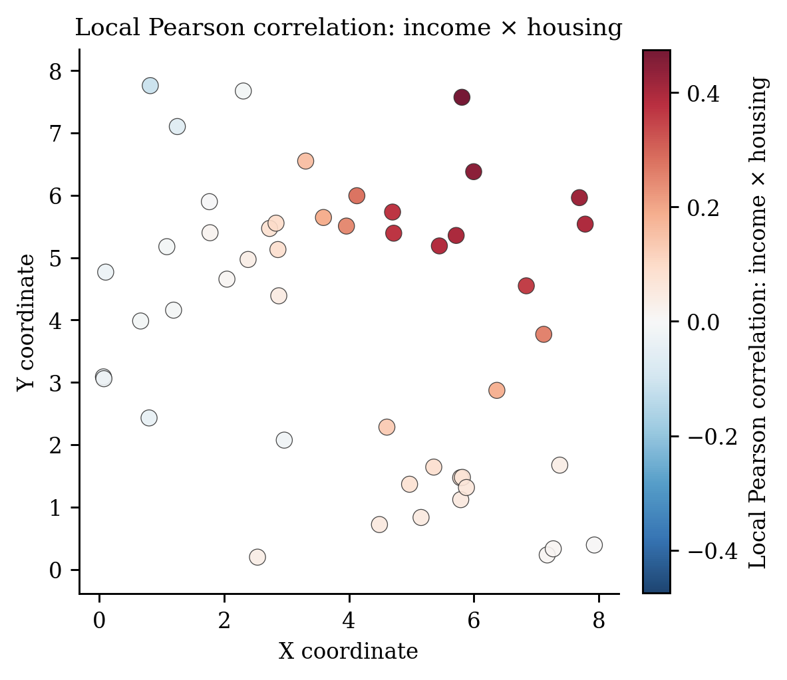

# Geographically Weighted Summary Statistics（`GWSS`）

> **pyGWRx 模型编号 13｜类别：局部探索性统计**
> 本文同时说明原始方法与当前 pyGWRx 实现。凡实现与论文求解器不同之处均会明确指出。

正式来源：[Brunsdon, Fotheringham & Charlton (2002), *Geographically weighted summary statistics*](https://doi.org/10.1016/S0198-9715(01)00009-6)。


## 1. 模型要解决的核心问题

空间统计中最危险的假设之一，是默认一组回归关系在整个研究区完全相同。若某个变量在城市中心、郊区、沿海和山区产生不同影响，一个全局系数只能给出平均效应，局部差异会被平均掉。地理加权方法的共同思想是：在每个目标位置建立一个局部窗口，让距离更近、时间更近、属性更相似或属于同一机制的观测获得更高权重，再估计该位置的局部统计量或局部模型。

需要强调：局部模型不是自动的因果模型。它首先是一种用于描述、探索和预测空间异质性的工具。带宽、核函数、局部共线性、异常值、残差空间相关和多重检验均会改变解释，必须与诊断一起使用。


## 2. 一句话思想

在回归之前先回答更基础的问题：均值、方差、偏度、分位数和变量相关性是否随空间变化。GWSS 是局部探索分析，而不是预测模型。

## 3. 数学模型

位置 $i$ 的归一化权重为 $\tilde w_{ij}=w_{ij}/\sum_jw_{ij}$。局部均值：

$$
\bar x_i=\sum_j\tilde w_{ij}x_j.
$$

带有效样本量修正的局部协方差可写为

$$
\operatorname{Cov}_i(x,y)=
\frac{\sum_j\tilde w_{ij}(x_j-\bar x_i)(y_j-\bar y_i)}
{1-\sum_j\tilde w_{ij}^2}.
$$

局部相关为协方差除以局部标准差乘积。加权分位数通过按值排序并累计归一化权重获得。

## 4. 算法流程

1. 选择核与带宽。
2. 为每个位置归一化权重。
3. 计算局部位置、离散、形状与分位统计量。
4. 对变量对计算局部协方差/相关。
5. 绘制地图识别异质性、异常区域和后续模型需求。

## 5. pyGWRx 当前实现

```python
from pygwrx import GWSS

model = GWSS(kernel='bisquare', bandwidth=None, adaptive=False, quantile=False, verbose=False)
```

pyGWRx 支持局部均值、方差、标准差、偏度、分位数、协方差和相关；自适应带宽严格按近邻数解释；协方差采用有效权重修正。

### 5.1 输入语义

- `X`：自变量矩阵；启用 `fit_intercept=True` 时由模型统一添加截距。
- `y`：响应或类别，具体形状和分布要求由模型决定。
- `coords`：校准位置坐标；经纬度数据在使用欧氏距离前应投影，或选择模型支持的相应距离语义。
- 带宽：固定模式表示距离阈值，自适应模式通常表示近邻数量；两者不能混为同一单位。

### 5.2 结果与诊断

应优先检查：拟合值与残差、局部系数、带宽或尺度、有效参数个数、AICc/CV、标准误与显著性、局部共线性、影响度、残差空间结构。模型专用结果请结合下方图件和 `pygwrx.diagnostics` 使用。

## 6. 适用场景

模型构建前的空间 EDA、变量分布非平稳检查、局部相关探索。

## 7. 关键局限与误用风险

局部相关不是回归效应或因果；多张地图会放大偶然模式；边缘区域权重不对称；描述性统计不提供 GWR 的 AIC/帽子矩阵。

## 8. 推荐可视化





## 9. 最小工作流

```python
# 以下是接口结构示意；不同模型的 fit 参数可能包括 times、attributes 或阶段列表。
model = GWSS(...)
model.fit(X, y, coords)

# 常见结果
# model.fitted_values_
# model.residuals_
# model.local_parameters_ / model.coef_
# model.diagnostics_
```

推荐工作顺序：全局模型 → 带宽/尺度选择 → 局部拟合 → 推断校正 → 局部共线性和影响诊断 → 空间分块验证 → 图件与结论。

## 10. 主要参考资料

- [Brunsdon, Fotheringham & Charlton (2002), *Geographically weighted summary statistics*](https://doi.org/10.1016/S0198-9715(01)00009-6)

---

**版本说明：** 本文依据当前 pyGWRx 0.1.2 Alpha 源码与算法知识库整理。它描述的是当前已验证实现，而不是对任意同名软件的泛化说明。


## 11. 当前能力边界

- **输入：** Multivariate X and coordinates
- **主要操作：** fit, select_bandwidth, summary
- **新位置能力：** Not applicable; this is a local-statistics estimator.
- **安装分组：** `base`
- **英文模型指南：** [打开](../../models/gwss.md)
- **API：** [打开](../../api/models/gwss.md)

## 12. 完整可运行示例

```python
# SPDX-FileCopyrightText: 2026 Jinghao Hu
# SPDX-License-Identifier: MIT

"""Compute geographically weighted summary statistics."""

from pygwrx import GWSS
from _common import spatial_regression

X, _, coords = spatial_regression(n=48, p=3)
model = GWSS(bandwidth=24, adaptive=True, quantile=True).fit(X, coords)
print(model.summary())
print("local_means_shape=", model.local_mean_.shape)
print("local_correlation_pairs=", sorted(model.local_corr_))
print("first_correlation_shape=", next(iter(model.local_corr_.values())).shape)
```

该脚本是项目 API—示例覆盖检查所使用的正式示例，可通过 `python examples/run_all.py` 批量运行。
