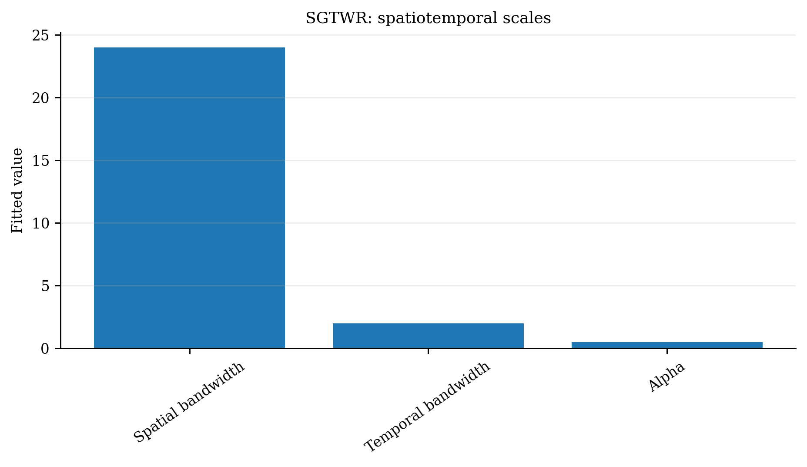
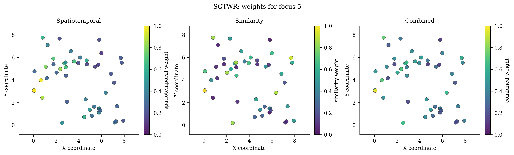

# Similarity Geographically and Temporally Weighted Regression（`SGTWR`）

> **pyGWRx 模型编号 09｜类别：空间—时间—属性三邻近回归**
> 本文同时说明原始方法与当前 pyGWRx 实现。凡实现与论文求解器不同之处均会明确指出。

本项目对应的正式来源：[Li et al. (2025), *SGTWR Model with Spatial-Temporal Heterogeneity and Attribute Similarity*](https://doi.org/10.3390/su172310773)。


## 1. 模型要解决的核心问题

空间统计中最危险的假设之一，是默认一组回归关系在整个研究区完全相同。若某个变量在城市中心、郊区、沿海和山区产生不同影响，一个全局系数只能给出平均效应，局部差异会被平均掉。地理加权方法的共同思想是：在每个目标位置建立一个局部窗口，让距离更近、时间更近、属性更相似或属于同一机制的观测获得更高权重，再估计该位置的局部统计量或局部模型。

需要强调：局部模型不是自动的因果模型。它首先是一种用于描述、探索和预测空间异质性的工具。带宽、核函数、局部共线性、异常值、残差空间相关和多重检验均会改变解释，必须与诊断一起使用。


## 2. 一句话思想

SGTWR 同时接受三种“近”：地理位置近、时间近、属性结构像。它适合某些远距离城市在同一发展阶段表现相似，而同城不同年代又可能差异明显的情形。

## 3. 数学模型

空间—时间 Gaussian 权重为

$$
w_{ij}^{ST}=\exp\left[-\frac12\left(
\left(\frac{d_{ij}^{S}}{h_i^{S}}\right)^2+
\left(\frac{d_{ij}^{T}}{h^{T}}\right)^2
\right)\right].
$$

属性相似性权重为

$$
w_{ij}^{A}=\exp\left[-\left(
\frac1m\sum_k|z_{ik}-z_{jk}|
\right)^2\right].
$$

综合权重为

$$
w_{ij}=\alpha w_{ij}^{ST}+(1-\alpha)w_{ij}^{A}.
$$

本项目分别选择空间带宽、时间带宽和 $\alpha$，而不把空间与时间预先压缩成单一距离。

## 4. 算法流程

1. 统一时间尺度并标准化相似属性。
2. 生成空间带宽候选、时间带宽候选和 $\alpha$ 候选。
3. 计算独立的空间—时间 Gaussian 权重。
4. 计算属性相似性权重。
5. 组合后标定局部 WLS并计算 AICc。
6. 确定性搜索最优参数；可启用 causal 过滤。

## 5. pyGWRx 当前实现

```python
from pygwrx import SGTWR

model = SGTWR(spatial_bandwidth='aicc', temporal_bandwidth='aicc', adaptive=True, alpha='aicc', similarity_vars=None, standardize_similarity=True, causal=False, time_unit='auto', ...)
```

pyGWRx 按 2025 论文公式实现，但参数求解采用可复现的 AICc 候选搜索，而不是论文案例中的遗传算法；这样易测试、结果确定，但大候选网格会更慢。

### 5.1 输入语义

- `X`：自变量矩阵；启用 `fit_intercept=True` 时由模型统一添加截距。
- `y`：响应或类别，具体形状和分布要求由模型决定。
- `coords`：校准位置坐标；经纬度数据在使用欧氏距离前应投影，或选择模型支持的相应距离语义。
- 带宽：固定模式表示距离阈值，自适应模式通常表示近邻数量；两者不能混为同一单位。

### 5.2 结果与诊断

应优先检查：拟合值与残差、局部系数、带宽或尺度、有效参数个数、AICc/CV、标准误与显著性、局部共线性、影响度、残差空间结构。模型专用结果请结合下方图件和 `pygwrx.diagnostics` 使用。

## 6. 适用场景

长时间、多地区面板数据中，空间、时间和城市/区域属性相似性共同塑造局部关系时使用。

## 7. 关键局限与误用风险

论文较新，外部复现仍少；三类权重可能相互补偿；相似属性选择影响极大；计算和内存高于 GTWR/SGWR；因果预测必须避免未来样本。

## 8. 推荐可视化





## 9. 最小工作流

```python
# 以下是接口结构示意；不同模型的 fit 参数可能包括 times、attributes 或阶段列表。
model = SGTWR(...)
model.fit(X, y, coords)

# 常见结果
# model.fitted_values_
# model.residuals_
# model.local_parameters_ / model.coef_
# model.diagnostics_
```

推荐工作顺序：全局模型 → 带宽/尺度选择 → 局部拟合 → 推断校正 → 局部共线性和影响诊断 → 空间分块验证 → 图件与结论。

## 10. 主要参考资料

- [Li et al. (2025), *SGTWR Model with Spatial-Temporal Heterogeneity and Attribute Similarity*](https://doi.org/10.3390/su172310773)
- [Lessani & Li (2024), *SGWR: similarity and geographically weighted regression*](https://doi.org/10.1080/13658816.2024.2342319)
- [Huang, Wu & Barry (2010), *Geographically and temporally weighted regression for modeling spatio-temporal variation in house prices*](https://doi.org/10.1080/13658810802672469)

---

**版本说明：** 本文依据当前 pyGWRx 0.1.2 Alpha 源码与算法知识库整理。它描述的是当前已验证实现，而不是对任意同名软件的泛化说明。


## 11. 当前能力边界

- **输入：** X, y, coordinates, times, and similarity variables
- **主要操作：** fit, predict, predict_result
- **新位置能力：** Validated at target space-time points with optional causal filtering.
- **安装分组：** `base`
- **英文模型指南：** [打开](../../models/sgtwr.md)
- **API：** [打开](../../api/models/sgtwr.md)

## 12. 完整可运行示例

```python
# SPDX-FileCopyrightText: 2026 Jinghao Hu
# SPDX-License-Identifier: MIT

"""Fit similarity and geographically-temporally weighted regression."""

from pygwrx import SGTWR, SGTWRPredictionResult
from _common import print_model_result, temporal_regression

X, y, coords, times = temporal_regression(n=48, p=3)
model = SGTWR(
    spatial_bandwidth=24,
    temporal_bandwidth=2.0,
    adaptive=True,
    alpha=0.5,
    similarity_vars=["x1", "x2"],
    store_weights=True,
).fit(X, y, coords, times)
print_model_result(model)
print("combined_weights_shape=", model.combined_weights_.shape)
result = model.predict_result(X.iloc[:3], coords.iloc[:3], times[:3])
assert isinstance(result, SGTWRPredictionResult)
print(result.to_frame())
```

该脚本是项目 API—示例覆盖检查所使用的正式示例，可通过 `python examples/run_all.py` 批量运行。
