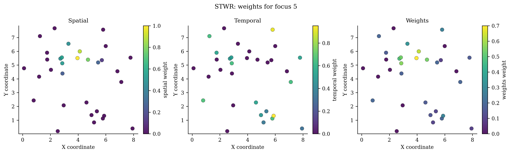

# Spatiotemporal Weighted Regression（`STWR`）

> **pyGWRx 模型编号 08｜类别：变化率驱动时空回归**
> 本文同时说明原始方法与当前 pyGWRx 实现。凡实现与论文求解器不同之处均会明确指出。

正式来源：[Que, Ma, Ma & Chen (2020), *A spatiotemporal weighted regression model (STWR v1.0)*](https://doi.org/10.5194/gmd-13-6149-2020)。


## 1. 模型要解决的核心问题

空间统计中最危险的假设之一，是默认一组回归关系在整个研究区完全相同。若某个变量在城市中心、郊区、沿海和山区产生不同影响，一个全局系数只能给出平均效应，局部差异会被平均掉。地理加权方法的共同思想是：在每个目标位置建立一个局部窗口，让距离更近、时间更近、属性更相似或属于同一机制的观测获得更高权重，再估计该位置的局部统计量或局部模型。

需要强调：局部模型不是自动的因果模型。它首先是一种用于描述、探索和预测空间异质性的工具。带宽、核函数、局部共线性、异常值、残差空间相关和多重检验均会改变解释，必须与诊断一起使用。


## 2. 一句话思想

GTWR 主要依据经过了多久来衡量时间距离；STWR 进一步问“过程改变了多少”。过去时段的观测是否有用，不只由时间间隔决定，还由响应值的变化率决定。

## 3. 数学模型

对当前时段 $t$ 的焦点 $i$ 和过去第 $q$ 个时段的样本 $j$，响应变化率型时间距离可写为

$$
d_{ij}^{T}=
\frac{\Delta t_{\mathrm{all}}}{\Delta t_q}
\left|\frac{y_{j,t-q}-y_{i,t}}{y_{j,t-q}}\right|.
$$

时间作用通过 sigmoid/tanh 型映射进入权重，例如

$$
K_T(d^T)=2\sigma(d^T)-1
=\frac{2}{1+e^{-d^T}}-1.
$$

空间核与时间项按 $\alpha$ 组合。历史阶段的空间带宽按

$$
h_{t-q}=h_t-\tan(\theta)\,\Delta t_q
$$

演化，并受最小可识别邻域约束。模型用最近 `tick_nums` 个阶段为最新阶段标定局部系数。

## 4. 算法流程

1. 把数据按时间阶段组织为坐标、X、y 列表。
2. 决定使用多少历史阶段。
3. 计算当前点到各历史阶段的空间距离。
4. 根据当前与历史响应构造变化率时间距离。
5. 结合 $\alpha$、$\theta$ 和阶段带宽形成时空权重。
6. 用当前阶段为校准位置、历史阶段为信息源做局部 WLS。
7. 通过 CV/AICc 候选搜索选择参数。

## 5. pyGWRx 当前实现

```python
from pygwrx import STWR

model = STWR(spatial_bandwidth='cv', adaptive=True, kernel='bisquare', alpha=0.3, theta=0.0, tick_nums=None, bandwidth_candidates=None, alpha_candidates=None, theta_candidates=None, tick_candidates=None, ...)
```

pyGWRx 依据 Que 等 2020 的正式 STWR 和作者公开代码重建：保留阶段顺序、变化率时间距离、sigmoid 时间效应、历史带宽演化和最新阶段预测；实现为确定性的 NumPy/SciPy 版本。

### 5.1 输入语义

- `X`：自变量矩阵；启用 `fit_intercept=True` 时由模型统一添加截距。
- `y`：响应或类别，具体形状和分布要求由模型决定。
- `coords`：校准位置坐标；经纬度数据在使用欧氏距离前应投影，或选择模型支持的相应距离语义。
- 带宽：固定模式表示距离阈值，自适应模式通常表示近邻数量；两者不能混为同一单位。

### 5.2 结果与诊断

应优先检查：拟合值与残差、局部系数、带宽或尺度、有效参数个数、AICc/CV、标准误与显著性、局部共线性、影响度、残差空间结构。模型专用结果请结合下方图件和 `pygwrx.diagnostics` 使用。

## 6. 适用场景

过程的时间相似性主要体现为变化状态而不只是时间间隔，例如环境变量、城市变化和动态社会经济关系。

## 7. 关键局限与误用风险

时间距离使用响应值，因此预测真正未知未来时需估计参考响应；接近零的历史响应需要稳定分母；阶段划分影响结果；它不是简单的连续时间 GTWR。

## 8. 推荐可视化



## 9. 最小工作流

```python
# 以下是接口结构示意；不同模型的 fit 参数可能包括 times、attributes 或阶段列表。
model = STWR(...)
model.fit(X, y, coords)

# 常见结果
# model.fitted_values_
# model.residuals_
# model.local_parameters_ / model.coef_
# model.diagnostics_
```

推荐工作顺序：全局模型 → 带宽/尺度选择 → 局部拟合 → 推断校正 → 局部共线性和影响诊断 → 空间分块验证 → 图件与结论。

## 10. 主要参考资料

- [Que, Ma, Ma & Chen (2020), *A spatiotemporal weighted regression model (STWR v1.0)*](https://doi.org/10.5194/gmd-13-6149-2020)

---

**版本说明：** 本文依据当前 pyGWRx 0.1.2 Alpha 源码与算法知识库整理。它描述的是当前已验证实现，而不是对任意同名软件的泛化说明。


## 11. 当前能力边界

- **输入：** Lists of X, y, and coordinates by stage, plus time intervals
- **主要操作：** fit, predict, predict_result
- **新位置能力：** Prediction for the current/latest stage using the fitted historical-stage weighting structure.
- **安装分组：** `base`
- **英文模型指南：** [打开](../../models/stwr.md)
- **API：** [打开](../../api/models/stwr.md)

## 12. 完整可运行示例

```python
# SPDX-FileCopyrightText: 2026 Jinghao Hu
# SPDX-License-Identifier: MIT

"""Fit STWR from multiple observation snapshots."""

from pygwrx import STWR, STWRPredictionResult
from _common import print_model_result, stwr_stages

X_list, y_list, coords_list, intervals = stwr_stages()
model = STWR(
    spatial_bandwidth=10,
    adaptive=True,
    alpha=0.3,
    theta=0.0,
    tick_nums=2,
    store_weights=True,
).fit(X_list, y_list, coords_list, intervals)
print_model_result(model)
result = model.predict_result(
    X_list[-1].iloc[:3],
    coords_list[-1].iloc[:3],
    reference_y=y_list[-1][:3],
)
assert isinstance(result, STWRPredictionResult)
print(result.to_frame())
```

该脚本是项目 API—示例覆盖检查所使用的正式示例，可通过 `python examples/run_all.py` 批量运行。
